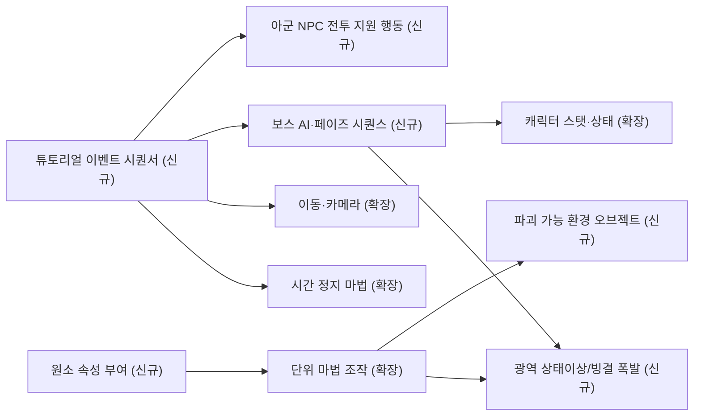

# 튜토리얼 씬 — 추가/확장 필요 시스템 목록

> 작성일: 2026-09-16
> 근거 문서:
> - 튜토리얼 씬 기획서: `Assets/00.Document/02.Tutorial/튜토리얼 씬 기획서.md`
> - 기존 시스템 분석: `Assets/00.Document/98.System/SystemAnalysis_2026-09-15/*.md` (8개 시스템)
> 범위: **목록과 분류 근거까지만.** 상세 기획(데이터 구조, API 시그니처, 구현 방식)은 이 문서 범위 밖.
> 검증 방식: 문서 대조 + 코드 grep(`Assets/02.System`, `Assets` 전체)으로 존재 여부 실측 확인. 확인 근거가 있는 항목은 분류를 확정했고, 근거가 부족한 항목은 4절 "확인 필요"로 분리했다.

---

## 1. 요구사항 추출 및 분류 (전체)

기획서 1~4단계 + 3장(연출/시스템 요구사항)에서 추출한 요구사항을 기존 8개 시스템과 대조한 결과. `A`=기존 시스템으로 충족, `B`=기존 시스템 확장 필요, `C`=신규 시스템 필요.

| # | 요구사항 (명시적 + 암묵적) | 단계 | 분류 | 근거 |
|---|---|---|---|---|
| 1 | 아군이 3~4초 간격으로 자동 투사체 발사 (퍼즐/보스전 지원사격) | 1, 3 | **C** | 플레이어 시전 시스템(단위 마법/전술 커맨드)만 존재. NPC 자동 발사 행동 코드 전무 (grep 결과 `Boss`/AI 관련 코드 0건) |
| 2 | 날아가는 투사체에 시간 정지 걸기 | 1, 4 | A | 시간 정지는 전역(`Time.timeScale`) 처리 — 4.시간 정지 마법 시스템으로 충족 |
| 3 | 투사체를 조준·선택(락온) 가능해야 함 | 1, 4 | **B** | 5.단위 마법 조작 시스템의 `MagicLockOnComponent`/`UnitCasterSystem`이 대상 락온을 담당하나, 고속 이동 중이던 소형 투사체 대상 판정 검증/보강 필요 |
| 4 | 투사체에 얼음 속성 부여 (원소 인챈트) | 1, 4 | **C** | `PureDataUnit`/`RuntimeDataUnit`은 질량·부피·방향벡터 등 "단위(Unit)" 수치만 다룸. 원소/속성 개념 자체가 코드에 없음 (grep: `Element`/`속성` 관련 시스템 코드 0건, 기획 문서만 존재) |
| 5 | 투사체 크기를 수배로 확대 | 1, 4 | **B**(부분 A) | 수치 확대 자체는 `MassUnitApplicatorSO`가 이미 질량비→`localScale` 세제곱근 스케일로 처리(A). 단, "마법 링 회전 + 즉각 팽창" 지정 VFX 훅은 없음(B) |
| 6 | 거대해진 투사체가 돌문과 충돌 → 파괴, 통로 개방 | 1 | **C** | 7.상호작용·피격 시스템(`CharacterDamagePipeLine`)은 `ICharacterStatService`(캐릭터)만 대상. 비-캐릭터 파괴형 오브젝트 처리 없음 (grep: `Destructible`/`Breakable` 코드 0건) |
| 7 | 보스 기본 공격 패턴, HP 50% 감지 후 페이즈 전환 | 2, 3 | **C** | 보스 AI/기믹 코드 전무 확인(grep: `Boss` 문자열이 코드에는 한 건도 없음, 기획서/GDD 문서에만 존재) |
| 8 | 보스 50% 도달 시 무적 전환 | 3 | **B** | `ICharacterStatService`/`CharacterDamagePipeLine`에 무적 플래그·차단 스텝 없음(grep: `Invulnerable`/`무적` 0건) → 캐릭터 스탯 시스템 또는 데미지 파이프라인에 추가해야 함 |
| 9 | 보스 회복 모션 + 체력 회복 | 3 | A(트리거는 C) | `Heal(int)` API는 기존(A). "HP 50% 도달 시 자동 발동"이라는 트리거 로직은 6번 시퀀서/보스 AI 소관 |
| 10 | 아군 지원 투사체 발사 연출용 짧은 카메라 컷 | 3 | **B** | 1.이동·카메라 시스템은 `CinemachineCamera` 3종(탑뷰/1인칭/숄더)을 유저 입력 기반으로만 전환. "특정 대상(투사체)을 자동으로 비추는 이벤트 카메라" 모드 없음 |
| 11 | 카메라가 투사체 방향으로 자동 전환 + 조준선 정렬 | 3 | **B** | 위와 동일 시스템의 확장 대상 |
| 12 | 시간 정지 자동 발동(유저 입력 없이) | 3 | A | `TimeSlowLogicSystem.ActivateSlow()` 외부 호출로 가능(API 존재) — 호출 주체(시퀀서)는 6번 |
| 13 | 시간 정지 중 타깃만 컬러, 배경 흑백(쿠로사와 필터) | 3 | A | 4.시간 정지 마법 시스템(`TargetStencilService`+`TargetStencilRendererFeature`)이 이미 구현 |
| 14 | 튜토리얼 중 시간정지 유지시간/마나 소모 무제한 완화 | 3 | **B** | `RuntimeDataTimeSlow.FocusGauge`, `ICharacterStatService.UseMP`엔 소모 자체를 억제하는 오버라이드 모드 없음 |
| 15 | 보스 핵 명중 시 광역 빙결 폭발, 지형까지 동결 | 4 | **C** | `CharacterDamagePipeLine`은 1:1 충돌 판정만 처리. 광역(AoE) 상태이상/지형 연출 시스템 없음 |
| 16 | 실패 시 보스 체력 60% 소폭 회복 + 즉시 재도전 트리거 | 4 | **C** | 6번 시퀀서/보스 AI 소관 |
| 17 | 튜토리얼 종료 후 승리 화면 전환 | 4 | **C** | 6번 시퀀서 소관 |
| 18 | 퍼즐 구간 고정 쿼터뷰 카메라 | 3-1 | **B** | 10/11과 동일 카메라 시스템 확장 대상(신규 프리셋 모드) |

---

## 2. 추가 필요 시스템 목록 (B/C만 통합)

여러 요구사항을 시스템 단위로 묶은 결과. **분류**는 신규(C) / 기존 확장(B)만 표시.

| 시스템명 (가칭) | 분류 | 관련 튜토리얼 단계 | 필요 이유 | 관련 기존 시스템 |
|---|---|---|---|---|
| **원소 속성 부여 시스템** (Elemental Attribute System) | 신규 | 1, 4단계 | 투사체에 "얼음 속성"을 부여하고 불/얼음 상성 반응(파지직 효과, 빙결 안개)을 일으키는 기능. 현재 단위 마법 시스템은 질량/부피/방향벡터만 다루고 원소 개념이 전혀 없음 (요구사항 #4) | — (없음, 단 단위 마법 조작 시스템과 강하게 연동될 것) |
| **아군 NPC 전투 지원 행동 시스템** (Ally Combat Behavior) | 신규 | 1, 3단계 | 아군이 주기적으로 투사체를 자동 발사(퍼즐 구간), 보스 50% 시점에 전장 밖에서 지원사격. NPC 자동 발사 행동이 프로젝트에 전혀 없음 (요구사항 #1) | — (없음) |
| **보스 AI · 페이즈 시퀀스 시스템** (Boss AI & Phase System) | 신규 | 2, 3, 4단계 | 기본 공격 패턴, HP 50% 감지 후 무적/회복 페이즈 전환, 실패 시 체력 소폭 회복 등 보스 전용 로직. 보스 관련 코드가 프로젝트에 전혀 존재하지 않음 (요구사항 #7, #16) | 캐릭터 스탯·상태 시스템(HP 이벤트 구독)과 연동 필요하나 로직 자체는 신규 |
| **파괴 가능 환경 오브젝트 시스템** (Destructible Environment) | 신규 | 1단계 | 돌문이 거대 얼음 투사체 충돌로 파괴되는 판정/연출. 기존 상호작용·피격 시스템은 캐릭터(HP 보유) 대상만 처리, 비-캐릭터 파괴 오브젝트 개념 없음 (요구사항 #6) | 상호작용·피격 시스템(충돌 판정 파이프라인)과 연동 필요 |
| **광역 상태이상/빙결 폭발 시스템** (AoE Status Effect) | 신규 | 4단계 | 보스 핵 명중 시 넓은 범위에 빙결 데미지 + 주변 지형 동결 연출. 기존 데미지 파이프라인은 1:1 충돌 판정만 지원 (요구사항 #15) | 상호작용·피격 시스템(`CharacterDamagePipeLine`)과 연동 필요 |
| **튜토리얼 이벤트 시퀀서 시스템** (Tutorial Event Sequencer) | 신규 | 전체(1~4단계) | 단계 전환, HP% 임계값 감지, 자동 시간정지/카메라 트리거, 실패-재도전 분기, 승리 화면 전환 등 전체 진행을 총괄하는 상위 오케스트레이터. 각 시스템을 이벤트로 묶는 계층이 프로젝트에 없음 (요구사항 #9 트리거, #12, #16, #17) | 거의 모든 시스템을 이벤트로 호출(연동)하나, 시퀀서 자체는 신규 |
| **단위 마법 조작 시스템 — 투사체 락온 판정 보강** | 기존 확장 | 1, 4단계 | 고속 이동 중이던 소형 투사체가 시간 정지 후 `MagicLockOnComponent`/`UnitCasterSystem`의 락온 대상으로 안정적으로 잡히는지 검증 및 보강 필요 (요구사항 #3) | 단위(Unit) 마법 조작 시스템 |
| **단위 마법 조작 시스템 — 크기 팽창 VFX 훅 추가** | 기존 확장 | 1, 4단계 | 수치 확대 자체는 `MassUnitApplicatorSO`(질량비 세제곱근 스케일)로 이미 동작하나, 기획서가 요구하는 "마법 링 회전 + 즉각 부풀어 오르는 타격감 있는 이펙트"에 대응하는 VFX 트리거 지점이 없음 (요구사항 #5) | 단위(Unit) 마법 조작 시스템 (`MassUnitApplicatorSO` / `IUnitTargetVisualizer`) |
| **캐릭터 스탯·상태 시스템 — 무적 플래그 + 튜토리얼 소모 무제한 오버라이드** | 기존 확장 | 3단계 | (1) 보스 무적 전환을 위한 `Invulnerable` 상태 플래그가 없음. (2) 튜토리얼 중 마나(`UseMP`) 소모를 억제하는 오버라이드 모드가 없음 (요구사항 #8, #14) | 캐릭터 스탯·상태 시스템 (`ICharacterStatService`) |
| **시간 정지 마법 시스템 — 튜토리얼 게이지 무제한 오버라이드** | 기존 확장 | 3단계 | `RuntimeDataTimeSlow.FocusGauge` 소모를 튜토리얼 이벤트 동안 억제하는 모드가 없음 (요구사항 #14) | 시간 정지(불릿타임) 마법 시스템 |
| **이동·카메라 시스템 — 이벤트 타겟 추적 카메라 모드 추가** | 기존 확장 | 1, 3단계 | 현재 `CameraFollowService`는 유저 입력 기반 3모드(1인칭/숄더/탑뷰) 전환만 지원. "날아가는 투사체를 자동으로 비추고 조준선을 정렬하는" 컷씬형 카메라, "퍼즐 구간 고정 쿼터뷰" 프리셋이 없음. 단, `Cinemachine`은 이미 프로젝트에 통합되어 있어 신규 가상 카메라 추가 + 모드 확장 형태로 가능해 보임 (요구사항 #10, #11, #18) | 이동·카메라 시스템 (`ICameraFollowService`, `CameraMode`) |

---

## 3. 시스템 간 의존 관계 (참고)

---

## 4. 확인 필요 항목 (임의 결론 내리지 않고 질문으로 남김)

| # | 항목 | 질문 |
|---|---|---|
| Q1 | 투사체 락온 판정 | 투사체를 기존 `RuntimeDataUnitGroup`을 부착한 "일반 대상"으로 취급해 `MagicLockOnComponent`가 그대로 락온하게 할지, 아니면 고속/소형 투사체 전용 별도 판정 로직(예: 궤적 예측, 판정 반경 확대)이 필요할지 확인 필요. |
| Q2 | 무적 상태 구현 위치 | 보스 무적을 `ICharacterStatService`(범용 캐릭터 스탯)에 플래그로 추가할지, 아니면 `CharacterDamagePipeLine`의 스텝(예: `InvulnerabilityCheckStep`)으로 처리할지, 아니면 이번 보스 한정 로직으로 별도 처리할지 확인 필요. |
| Q3 | 이벤트 카메라 구현 방식 | "투사체 자동 추적 카메라"를 기존 `CameraMode` enum에 신규 케이스로 추가(예: `EventFollow`)할지, 아니면 Timeline/PlayableDirector 같은 별도 컷씬 기술을 새로 도입할지 확인 필요 (현재 프로젝트에 Timeline/PlayableDirector 사용 이력 없음, Cinemachine만 존재). |
| Q4 | 광역 빙결 폭발의 범용성 | 이번 튜토리얼 보스 전용 하드코딩 연출로 처리해도 되는지, 아니면 향후 다른 보스/스테이지에서도 재사용할 "범용 AoE 상태이상 프레임워크"로 설계해야 하는지 확인 필요 (설계 범위/투입 공수에 영향). |
| Q5 | 튜토리얼 소모 무제한 오버라이드의 범용성 | 이 오버라이드를 "튜토리얼 씬 전용 로컬 로직"으로 최소 구현할지, 아니면 이후 디버그/치트 시스템 등에서도 재사용할 "범용 스탯 오버라이드 모드"로 설계해야 하는지 확인 필요. |
| Q6 | 원소 속성 부여와 단위 마법 조작의 관계 | 원소 속성(불/얼음)을 `PureDataUnit`/`RuntimeDataUnit`에 필드로 얹어 "단위 마법 조작 시스템"의 확장(B)으로 볼지, 완전히 독립된 신규 시스템(C)이 단위 마법 조작 시스템과 나란히 연동되는 구조로 볼지 — 이 문서에서는 후자(C)로 잠정 분류했으나 실제 데이터 구조 설계 단계에서 재검토 필요. |

---

## 5. 요약

- **신규 개발 필요 (C)**: 6개 — 원소 속성 부여, 아군 NPC 전투 지원, 보스 AI·페이즈 시퀀스, 파괴 가능 환경 오브젝트, 광역 상태이상/빙결 폭발, 튜토리얼 이벤트 시퀀서
- **기존 시스템 확장 필요 (B)**: 5개 — 단위 마법 조작(락온 보강, VFX 훅), 캐릭터 스탯·상태(무적+오버라이드), 시간 정지 마법(게이지 오버라이드), 이동·카메라(이벤트 타겟 추적 모드)
- **확인 필요**: 6건 (Q1~Q6, 위 4절 참고)
