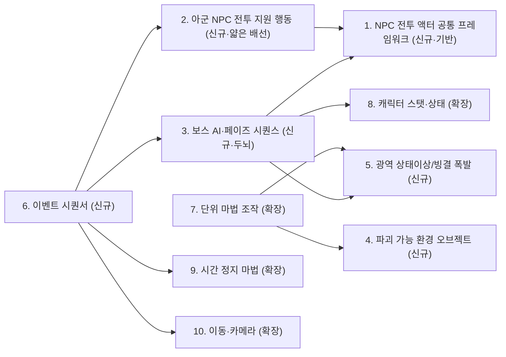

# 튜토리얼 추가/확장 시스템 상세 기획서 — 개요

> 작성일: 2026-09-16 (세션 1) / 2026-09-16 (세션 2, 재구성) / 2026-09-16 (세션 3, 피격 파이프라인 구체화)
> 근거 문서:
> - 추가 필요 시스템 목록: `Assets/00.Document/02.Tutorial/00.RequiredSystems_2026-09-16/00_추가필요시스템목록.md`
> - 튜토리얼 씬 기획서: `Assets/00.Document/02.Tutorial/튜토리얼 씬 기획서.md`
> - 사용자 리뷰: `Assets/00.Document/02.Tutorial/00.RequiredSystems_2026-09-16/00.추가필요시스템목록 리뷰.txt`

## 세션 1 — 리뷰 반영 사항 (기존 분류/설계 방향 수정)

목록 문서 작성 이후 리뷰를 통해 아래 내용이 확정/수정되었고, 각 시스템 문서에 반영했다.

1. **투사체 락온 판정**: 조준은 항상 "시간 정지로 완전히 멈춘" 투사체에 대해서만 이루어지므로, 고속 이동 대상에 대한 별도 판정 로직이 필요 없다 — 기존 락온 로직 그대로 사용. (→ [07.단위마법조작시스템확장_온도단위및조준연출보강.md](./07.단위마법조작시스템확장_온도단위및조준연출보강.md)에 흡수)
2. **얼음 속성 부여**: "원소/속성"이라는 별개 개념이 아니라, 기존 "단위(Unit)" 개념의 연장인 **온도(Temperature) 단위** 값의 부호로 표현한다 (음수=얼음, 양수=불 방향). 따라서 완전 신규 시스템(C)이 아니라 **단위 마법 조작 시스템의 확장(B)**으로 재분류했다.
3. **조준/시전 입력 방식**: 초기 탑뷰 시점 기준의 "방향 직접 조작" 개념이 일부 남아있으나, 현재 시점(1인칭/숄더/탑뷰 전환 가능)에 맞춰 "마우스로 도착 지점을 지정"하는 방식으로 정리한다.
4. **상호작용·피격 시스템 구조**: 현재 데미지 파이프라인이 하나로 고정돼 있는데, 캐릭터/오브젝트별로 "공격 파이프라인 → 상대 피격 파이프라인" 전송 구조로 분리하는 방안이 제안되었다. 확정 사항은 아니며, 파괴 가능 환경 오브젝트/광역 상태이상 문서에 "검토 필요" 항목으로 기재했다.
5. **자동 시간 정지 / 소모 무제한 오버라이드**: 반드시 이벤트 시퀀서(또는 그에 준하는 이벤트 전용 API)를 통해서만 트리거되어야 하며, 다른 시스템이나 유저 입력이 직접 접근할 수 없어야 한다. 현재 시간 정지 시스템이 플레이어(캐릭터 스탯·상태 시스템)에 종속돼 있다면, 플레이어와 무관하게 독립적으로 동작할 수 있도록 분리하는 것도 검토 가치가 있다.

## 세션 2 — 설계 확정 사항 (아군 NPC / 보스 AI / 이벤트 시퀀서 재구성)

세션 1에서 "아군 NPC 전투 지원 행동 시스템"과 "보스 AI 페이즈 시퀀스 시스템"을 각각 독립된 신규 시스템으로 분류했으나, 논의를 거쳐 **"몸통(액추에이터)과 두뇌(브레인)를 분리"**하는 구조로 재설계했다.

**결정 배경 — 일반적인 이벤트 시스템 방식 비교:**

| 방식 | 비고 |
|---|---|
| Unity Timeline + Signal | 조건 분기·재시도 루프(4단계 실패→재도전) 표현에 약함, 프로젝트에 Timeline 사용 이력 없음 |
| ScriptableObject 이벤트 채널 | 기존 인터페이스+DI 디커플링 방식과 별도의 두 번째 디커플링 체계가 생겨 일관성이 깨짐 |
| 비주얼 스크립팅(Bolt/PlayMaker 등) | 코드 중심으로 짜인 이 프로젝트에 신규 패러다임 도입 비용이 큼 |
| **코드 기반 명시적 상태 머신 + `event Action<T>` 방송** (채택) | `PlayerStateLogicSystem`(Normal/Casting/TimeSlow)과 동일한 프로젝트 기존 관례, 조건 분기·재시도 루프 표현이 자연스럽고 신규 의존성 없음 |

→ [06.이벤트시퀀서시스템.md](./06.이벤트시퀀서시스템.md)는 코드 기반 상태 머신 + 기존 이벤트 패턴으로 구현하기로 확정.

**결정 배경 — 적 NPC(보스) 구현 방식 비교:**

| 방식 | 비고 |
|---|---|
| Behavior Tree | 적이 보스 1종뿐인 지금은 트리 프레임워크 도입이 과잉 설계, 적 종류가 늘어나면 도입 가치 있음 |
| Utility AI / GOAP | 보스가 "스크립트대로 진행되는 정해진 연출"이라 동적 의사결정 자체가 불필요 |
| **FSM + PureData 기반 패턴 자산** (채택) | 프로젝트가 이미 쓰는 `PureDataUnit` 등과 동일한 결, `PlayerStateLogicSystem`과 같은 FSM 컨벤션 재사용 |

**핵심 구조 변경**:
- 신설: [01.NPC전투액터공통프레임워크.md](./01.NPC전투액터공통프레임워크.md) — 아군/보스가 공유하는 "몸통"(`INpcCombatActor`: 이동·공격 실행). 나중에 다른 스테이지의 적/아군이 늘어나도 이 몸통을 그대로 재사용한다.
- [02.아군NPC전투지원행동시스템.md](./02.아군NPC전투지원행동시스템.md): 자체 AI 없이, 01번 프레임워크에 이벤트 시퀀서가 `Attack(target)`을 호출해주는 얇은 배선으로 축소.
- [03.보스AI페이즈시퀀스시스템.md](./03.보스AI페이즈시퀀스시스템.md): 01번 프레임워크를 "몸통"으로 참조하는 FSM("두뇌")으로 재정의. **상속이 아니라 컴포지션(참조·주입)**으로 구성한다 — `OptionUIComponent`/`CameraOptionUIController` 상속 구조에서 발생한 중복 인스턴스 등록 버그, `ITargetStencilService` 이중 등록 버그(둘 다 기존 시스템 분석 문서에서 확인된 실제 사례)를 반복하지 않기 위함.
- 이렇게 몸통/두뇌를 분리해두면, 나중에 적 종류가 늘어나 Behavior Tree 같은 더 복잡한 AI가 필요해져도 **두뇌만 교체**하면 되고 몸통(01번 프레임워크)은 그대로 재사용 가능하다.

## 세션 3 — 설계 확정 사항 (피격 파이프라인 구체화)

세션 1에서 "검토 필요"로만 남겨뒀던 공격/피격 파이프라인 분리를, 첨부 문서 텍스트 리뷰(3.7/4.7)를 계기로 구체적인 구현 설계까지 확정했다.

1. **`IDamageable` 인터페이스 도입**: `ICharacterStatService`(HP/MP/마법슬롯 전부 포함)만 대상으로 하던 한계를 벗어나기 위해, "피격당할 수 있다"는 사실만 표현하는 얇은 `IDamageable`을 분리했다. 캐릭터는 `ICharacterStatService`가 이를 구현(위임)하고, 돌문 같은 단순 오브젝트는 `IDamageable`만 직접 구현한다.
2. **피격 파이프라인은 대상별로 스텝을 다르게 구성**: 캐릭터는 기존 5스텝(회피→방어→치명타→차단→적용)을 그대로 쓰고, 돌문은 **속성(온도) 게이트 → 데미지 크기 게이트** 2단만 갖는 경량 파이프라인을 쓴다. 돌문의 데미지 계산은 [07.단위마법조작시스템확장_온도단위및조준연출보강.md](./07.단위마법조작시스템확장_온도단위및조준연출보강.md)의 질량 비율(스케일 계산과 동일한 값)을 그대로 재사용한다. 상세는 [04.파괴가능환경오브젝트시스템.md](./04.파괴가능환경오브젝트시스템.md) 참고.
3. **판정은 매 충돌마다 독립적(누적 없음)**: 돌문의 "HP 100"은 지속 체력이 아니라 매 타격 단발 임계값이다 — 그렇지 않으면 무속성 공격이 여러 번 누적되어 퍼즐 의도(반드시 얼음+확대 조작 필요)와 무관하게 우연히 파괴될 수 있다.
4. **"피격 판정"과 "데미지 판정"을 분리해 컨텍스트에 누적**: 파이프라인은 `HitContext`를 누적하며 진행되고, "피격이 발생했다"는 사실은 데미지가 실제로 적용됐는지(무적·속성 불일치 등으로 무효화됐는지)와 무관하게 항상 기록된다. 이 패턴은 [08.캐릭터스탯상태시스템확장_무적플래그및오버라이드.md](./08.캐릭터스탯상태시스템확장_무적플래그및오버라이드.md)(무적 상태에서도 피격 신호는 발행)와 [04.파괴가능환경오브젝트시스템.md](./04.파괴가능환경오브젝트시스템.md)(속성은 맞아도 크기가 부족하면 파손→복구)에 동일하게 적용된다.
5. **"핵 명중" 전용 히트박스 폐기**: 보스의 "핵 명중" 판정을 위한 별도 콜라이더/물리 판정을 두지 않는다. 대신 [06.이벤트시퀀서시스템.md](./06.이벤트시퀀서시스템.md)가 (이 보스 + 회복 페이즈 상태 + `HitContext`의 온도 속성 게이트 통과)라는 상태 조합을 직접 판단해 성공/실패를 결정한다 — "핵"은 이제 순수 연출 개념일 뿐이다. 상세는 [05.광역상태이상빙결폭발시스템.md](./05.광역상태이상빙결폭발시스템.md) 참고.

## 시스템 목록

| # | 문서 | 분류 | 관련 단계 |
|---|---|---|---|
| 1 | [01.NPC전투액터공통프레임워크.md](./01.NPC전투액터공통프레임워크.md) | 신규(기반) | 1~4단계 간접 |
| 2 | [02.아군NPC전투지원행동시스템.md](./02.아군NPC전투지원행동시스템.md) | 신규(얇은 배선) | 1, 3단계 |
| 3 | [03.보스AI페이즈시퀀스시스템.md](./03.보스AI페이즈시퀀스시스템.md) | 신규(두뇌·FSM) | 2, 3, 4단계 |
| 4 | [04.파괴가능환경오브젝트시스템.md](./04.파괴가능환경오브젝트시스템.md) | 신규 | 1단계 |
| 5 | [05.광역상태이상빙결폭발시스템.md](./05.광역상태이상빙결폭발시스템.md) | 신규 | 4단계 |
| 6 | [06.이벤트시퀀서시스템.md](./06.이벤트시퀀서시스템.md) | 신규 | 전체(1~4단계) |
| 7 | [07.단위마법조작시스템확장_온도단위및조준연출보강.md](./07.단위마법조작시스템확장_온도단위및조준연출보강.md) | 기존 확장 | 1, 4단계 |
| 8 | [08.캐릭터스탯상태시스템확장_무적플래그및오버라이드.md](./08.캐릭터스탯상태시스템확장_무적플래그및오버라이드.md) | 기존 확장 | 3단계 |
| 9 | [09.시간정지마법시스템확장_게이지오버라이드.md](./09.시간정지마법시스템확장_게이지오버라이드.md) | 기존 확장 | 3단계 |
| 10 | [10.이동카메라시스템확장_이벤트타겟추적카메라.md](./10.이동카메라시스템확장_이벤트타겟추적카메라.md) | 기존 확장 | 1, 3단계 |

## 시스템 간 의존 관계 (참고)

