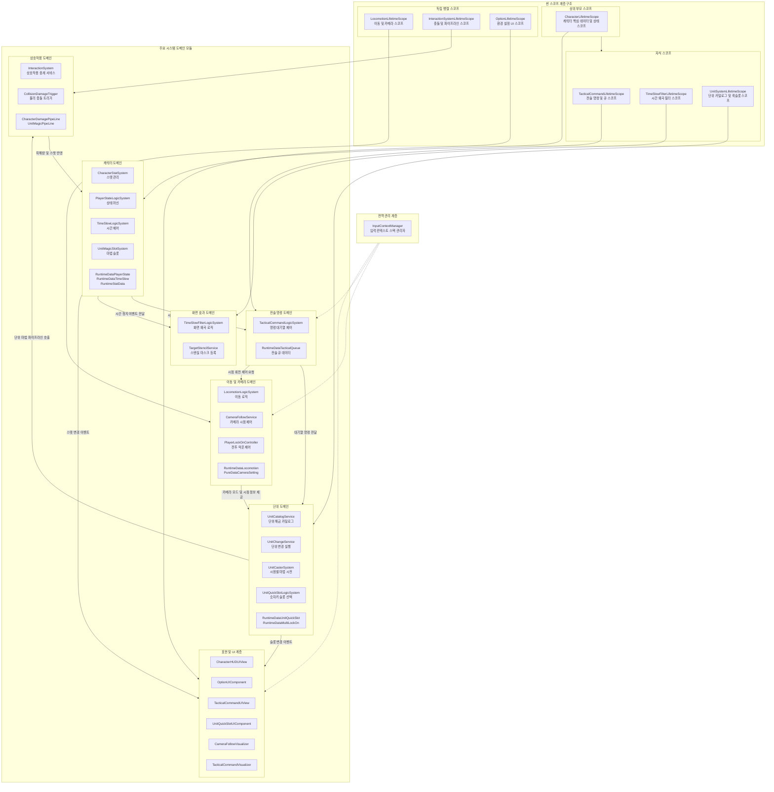

# 전체 프로젝트 거시 구조 (Global Architecture)

---

## 1. 개요
본 문서는 유니티 프로젝트의 컨테이너 스코프 계층 구조와 핵심 도메인 모듈 간의 상위 레벨 의존성 및 데이터 흐름을 시각화한 거시 아키텍처 명세서입니다.

---

## 2. 전체 거시 구조 다이어그램



---

## 3. 스코프 구성 요소 분석

1. **상위 부모 스코프 (`CharacterLifetimeScope`)**
   - 플레이어의 체력, 마나, 상태 머신, 시간 왜곡 데이터 등 코어 런타임 데이터를 보유합니다.
   - 하위 자식 스코프에 데이터를 상속 주입하는 역할을 담당합니다.

2. **자식 스코프군**
   - `TacticalCommandLifetimeScope`: 시간 정지 시점의 명령 대기열 및 조준 제어
   - `TimeSlowFilterLifetimeScope`: 시간 왜곡 화면 셰이더 및 스텐실 마스킹 처리
   - `UnitSystemLifetimeScope`: 단위 변경, 퀵슬롯 선택, 시점별 마법 시전 처리

3. **독립 병렬 스코프군**
   - `LocomotionLifetimeScope`: 플레이어 3인칭 이동, 락온, 카메라 추적 관리
   - `InteractionSystemLifetimeScope`: 물리 충돌 판정 및 비동기 데미지 파이프라인 중계
   - `OptionLifetimeScope`: 환경 설정 및 메뉴 UI 관리

4. **전역 관리 계층**
   - `InputContextManager`: 인게임 플레이, 전술 모드, UI 모드에 따른 입력 액션 맵과 마우스 커서 상태를 총괄 관리합니다.

---

## 4. 거시 아키텍처 점검 사항

1. **스코프 계층의 수평 분산으로 인한 씬 탐색 유발**
   - 최상위 루트 스코프 부재: 씬 단위의 최상위 스코프가 부재하여 `CharacterLifetimeScope`와 `LocomotionLifetimeScope`가 수평 독립 상태로 배치되어 있습니다.
   - 주입 경로 단절: 이로 인해 전술 명령 시스템과 단위 시스템에서 카메라 서비스나 UI 컴포넌트를 주입받지 못하고 `FindAnyObjectByType`을 사용하여 씬 전체를 탐색하는 구조적 결함이 발생합니다.

2. **전역 관리자의 컨테이너 외곽 배치**
   - 입력 컨텍스트 매니저가 유니티 정적 싱글톤 형태로 씬 외부에서 동적 생성(`DontDestroyOnLoad`)되므로, 컨테이너의 라이프사이클 관리와 명시적 주입 경로에서 벗어나 있습니다.

3. **이벤트 중복 구독 및 우선순위 부재**
   - 하위 시스템들이 동일한 입력 이벤트(`Look`, `onMouseWheelScrolled`)를 각자 개별 구독하여 조작 컨텍스트 전환 시 입력 우선순위 제어가 취약합니다.

---

## 5. 리팩토링 실행 프롬프트 (/goal)

```text
/goal 전체 스코프 계층 구조 및 의존성 주입 흐름 정상화 리팩토링

당신은 유니티 아키텍처 및 VContainer 전문 시니어 프로그래머입니다.
현재 프로젝트의 분산된 스코프 계층 구조를 정돈하여 직접 씬 탐색과 서비스 로케이터 오용을 근본적으로 해결해 주세요.

[목표]
형제 스코프 간 통신 불가로 인해 발생한 FindAnyObjectByType 씬 탐색과 IObjectResolver 역조회를 제거하고, 명시적인 스코프 계층 및 의존성 주입 구조를 확립합니다.

[요구사항]
1. 스코프 계층 통합 및 재설계:
   - RootLifetimeScope 또는 통합 GameLifetimeScope를 정의하여 전역 관리자(InputContextManager 등)를 정식 등록.
   - CharacterLifetimeScope와 LocomotionLifetimeScope 간의 상하 또는 부모-자식 관계를 명확히 정립하여 카메라 서비스와 캐릭터 데이터가 자연스럽게 주입되도록 개선.
2. 씬 탐색 제거:
   - TacticalCommandLifetimeScope 및 UnitSystemLifetimeScope에서 발생하던 FindAnyObjectByType 호출을 VContainer 정식 주입으로 대체.
3. 코드 안전성:
   - 컴파일 에러가 없어야 하며 씬 진입 시 VContainerException 없이 모든 컴포넌트가 정상 바인딩되어야 함.
```
