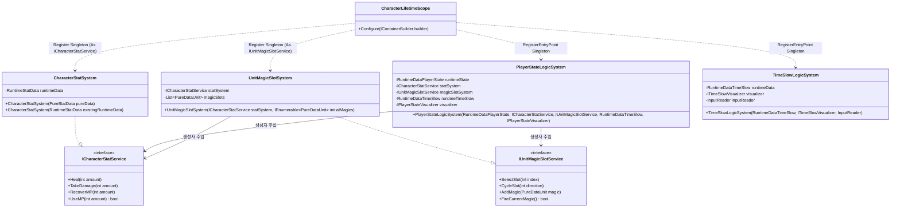
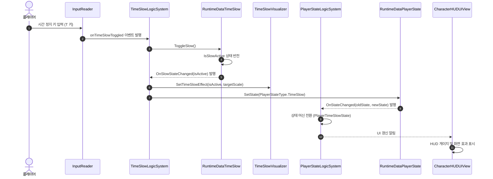
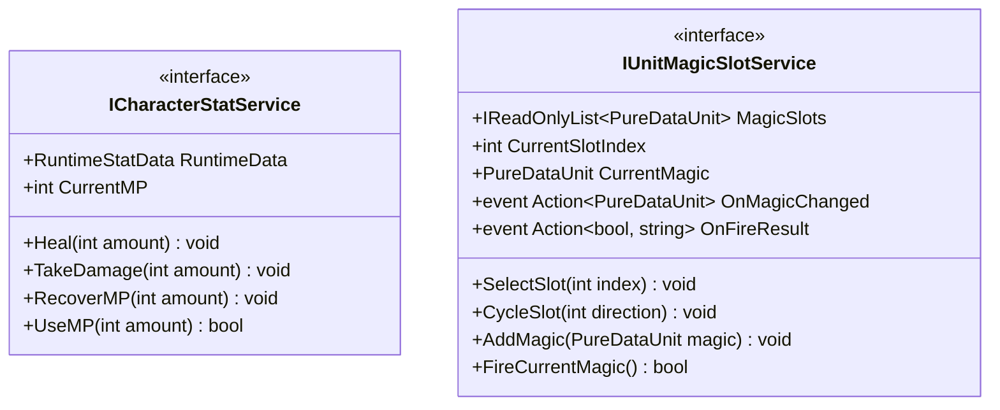

# 01. CharacterSystem (캐릭터 스탯 및 상태 관리 시스템)

---

## 1. VContainer 주입 관계



---

## 2. 데이터 흐름 및 호출 시퀀스



---

## 3. 인터페이스 명세 및 Public 메서드 연결점



### 연결 매핑 테이블
| 호출 주체 (Caller) | 공개 메서드 / 프로퍼티 (Public API) | 수신 주체 (Callee) | 전달/반환 데이터 (Payload) | 비고 |
|---|---|---|---|---|
| InteractionSystem | `ICharacterStatService.TakeDamage(int amount)` | CharacterStatSystem | `int amount` (데미지 수치) | 피격 시 체력 차감 |
| UnitChangeService | `ICharacterStatService.UseMP(int amount)` | CharacterStatSystem | `int amount` (필요 마나량) / 반환 `bool` | 마법 시전 가능 여부 판정 |
| PlayerStateLogicSystem | `ICharacterStatService.CurrentMP` | CharacterStatSystem | 반환 `int` (현재 마나 수치) | 마나 보유량 조회 |
| UnitQuickSlotLogicSystem | `IUnitMagicSlotService.SelectSlot(int index)` | UnitMagicSlotSystem | `int index` (슬롯 번호) | 활성 마법 슬롯 교체 |
| TacticalCommandLogicSystem | `RuntimeDataTimeSlow.IsSlowActive` | RuntimeDataTimeSlow | 반환 `bool` | 전술 모드 진입 판정 |

---

## 4. 아키텍처 점검 사항

1. **가변 런타임 데이터 노출로 인한 캡슐화 훼손**
   - `CharacterStatSystem.RuntimeData`: 내부에서 관리되는 `RuntimeStatData`가 그대로 외부에 열려 있습니다. 이로 인해 `HP.CurrentValue`, `MP.CurrentValue` 같은 필드를 타 시스템(`InteractionSystem`, `UnitChangeService`)에서 서비스 검증 없이 직접 조작할 수 있어 데이터 무결성이 깨질 위험이 큽니다.
   - 방어 코드 누락: `TakeDamage`, `UseMP` 등 정식 비즈니스 로직 메서드를 우회하는 접근을 원천 차단하지 못하고 있습니다.

2. **상태 머신과 시간 제어 데이터의 이중 관리**
   - `PlayerStateLogicSystem`이 `RuntimeDataTimeSlow`를 직접 참조하여 상태 전환을 판정하고, 동시에 `TimeSlowLogicSystem`도 동일 데이터를 제어하고 있어 상태 머신 내부 상태와 실제 시간 배율 상태 간의 불일치 가능성이 존재합니다.

3. **스탯 변경 이벤트 표준화 부재**
   - 체력과 마나의 변경 알림이 세부 필드 단위(`HP.OnValueChanged`)로 파편화되어 있어, UI 및 외부 시스템이 스탯 변화를 감지할 때 구독 지점이 복잡해지는 문제가 있습니다.

---

## 5. 리팩토링 실행 프롬프트 (/goal)

```text
/goal CharacterSystem 스탯 데이터 캡슐화 및 무결성 강화 리팩토링

당신은 유니티 아키텍처 및 객체지향 설계 전문 시니어 프로그래머입니다.
CharacterSystem의 스탯 데이터 노출 문제를 해결하고 완벽한 캡슐화 구조를 구현해 주세요.

[목표]
RuntimeStatData의 가변 프로퍼티가 외부에 직접 노출되어 임의로 수정되는 문제를 차단하고, 스탯 연산이 반드시 ICharacterStatService의 공식 메서드를 통해서만 발생하도록 통제합니다.

[요구사항]
1. 캡슐화 강화:
   - CharacterStatSystem의 RuntimeData 프로퍼티를 읽기 전용 뷰 또는 래퍼 인터페이스로 제한하여 제공.
   - 외부 시스템(InteractionSystem, UnitChangeService)에서 RuntimeData.HP.Reduce 등을 직접 호출하지 못하도록 차단.
2. 상태 변경 이벤트 표준화:
   - HP/MP 변경 시 발행되는 C# 이벤트를 일관되게 정비하여 UI 및 시각화 컴포넌트가 안정적으로 구독하도록 보장.
3. 무결성 검증:
   - 캐릭터 피격, 힐, 마나 사용 시 기존 게임플레이 로직이 100% 정상 작동하는지 확인.
```
