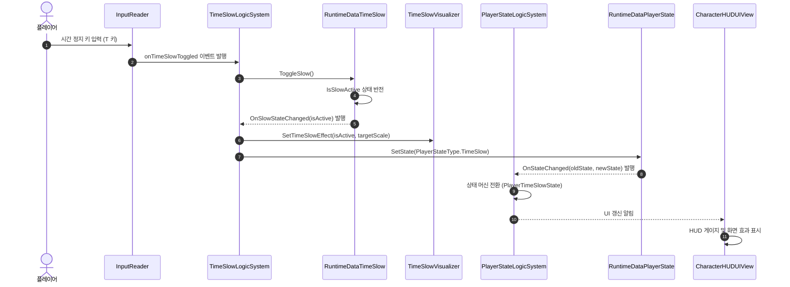
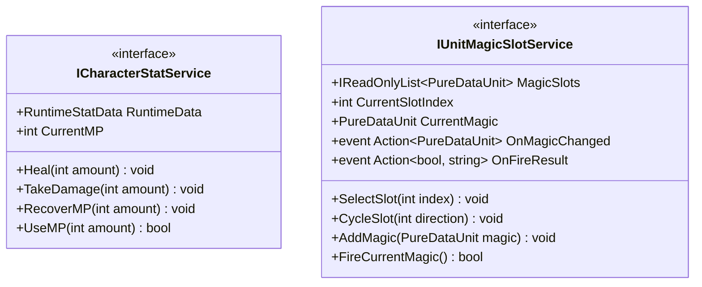

# 01. CharacterSystem (캐릭터 스탯 및 상태 관리 시스템)

---

## 1. VContainer 주입 관계

---

## 2. 데이터 흐름 및 호출 시퀀스

---

## 3. 인터페이스 명세 및 Public 메서드 연결점

### 연결 매핑 테이블
| 호출 주체 (Caller) | 공개 메서드 / 프로퍼티 (Public API) | 수신 주체 (Callee) | 전달/반환 데이터 (Payload) | 비고 |
|---|---|---|---|---|
| InteractionSystem | `ICharacterStatService.TakeDamage(int amount)` | CharacterStatSystem | `int amount` (데미지 수치) | 피격 시 체력 차감 |
| UnitChangeService | `ICharacterStatService.UseMP(int amount)` | CharacterStatSystem | `int amount` (필요 마나량) / 반환 `bool` | 마법 시전 가능 여부 판정 |
| PlayerStateLogicSystem | `ICharacterStatService.CurrentMP` | CharacterStatSystem | 반환 `int` (현재 마나 수치) | 마나 보유량 조회 |
| UnitQuickSlotLogicSystem | `IUnitMagicSlotService.SelectSlot(int index)` | UnitMagicSlotSystem | `int index` (슬롯 번호) | 활성 마법 슬롯 교체 |
| TacticalCommandLogicSystem | `RuntimeDataTimeSlow.IsSlowActive` | RuntimeDataTimeSlow | 반환 `bool` | 전술 모드 진입 판정 |

---

## 4. 아키텍처 점검 사항
- `CharacterStatSystem.RuntimeData` 프로퍼티가 가변 데이터인 `RuntimeStatData`를 그대로 반환하여 외부에서 체력 및 마나 값을 직접 수정할 위험이 있습니다. 불필요한 내부 접근을 차단하는 캡슐화 보완이 필요합니다.
