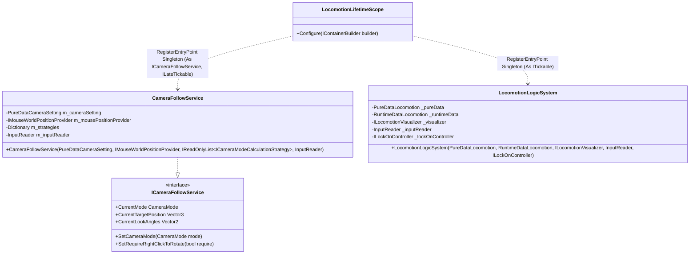
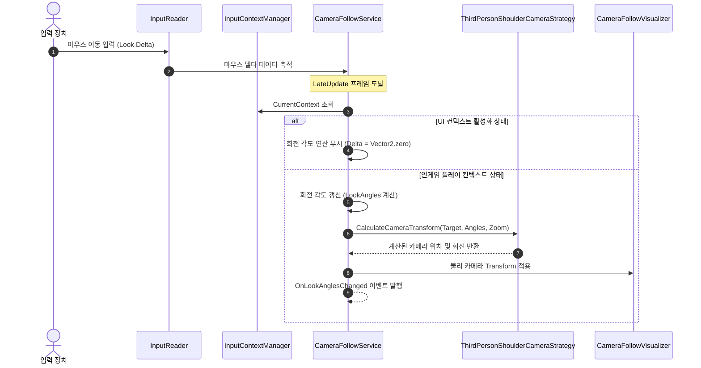
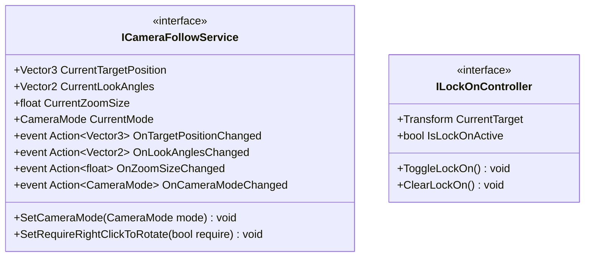

# 02. Locomotion & CameraSystem (로코모션 및 카메라 시스템)

---

## 1. VContainer 주입 관계

---

## 2. 데이터 흐름 및 호출 시퀀스

---

## 3. 인터페이스 명세 및 Public 메서드 연결점

### 연결 매핑 테이블
| 호출 주체 (Caller) | 공개 메서드 / 프로퍼티 (Public API) | 수신 주체 (Callee) | 전달/반환 데이터 (Payload) | 비고 |
|---|---|---|---|---|
| TacticalCommandLogicSystem | `ICameraFollowService.SetRequireRightClickToRotate(bool)` | CameraFollowService | `bool require` (우클릭 회전 필수 여부) | 시간 정지 모드 시점 회전 제한 |
| UnitCasterSystem | `ICameraFollowService.CurrentMode` | CameraFollowService | 반환 `CameraMode` (현재 카메라 모드) | 시점 모드별 시전 전략 교체 |
| UnitCasterSystem | `ICameraFollowService.OnCameraModeChanged` | CameraFollowService | 이벤트 구독 `Action<CameraMode>` | 숄더뷰/탑뷰 전환 감지 |
| LocomotionLogicSystem | `ILockOnController.IsLockOnActive` | PlayerLockOnController | 반환 `bool` | 전투 락온 중 이동 방향 고정 |

---

## 4. 아키텍처 점검 사항
- `CurrentTargetPosition`과 `TargetPosition`, `CurrentLookAngles`와 `LookAngles`의 프로퍼티 중복 노출을 정리하여 단일화할 필요가 있습니다.
- `CameraFollowService`가 `InputContextManager.Instance` 정적 싱글톤을 직접 참조하고 있으므로, 추후 생성자 주입으로 전환하여 결합도를 낮추는 리팩토링이 권장됩니다.
