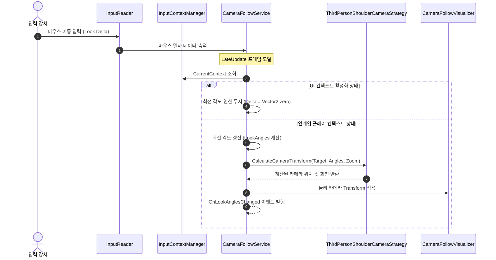
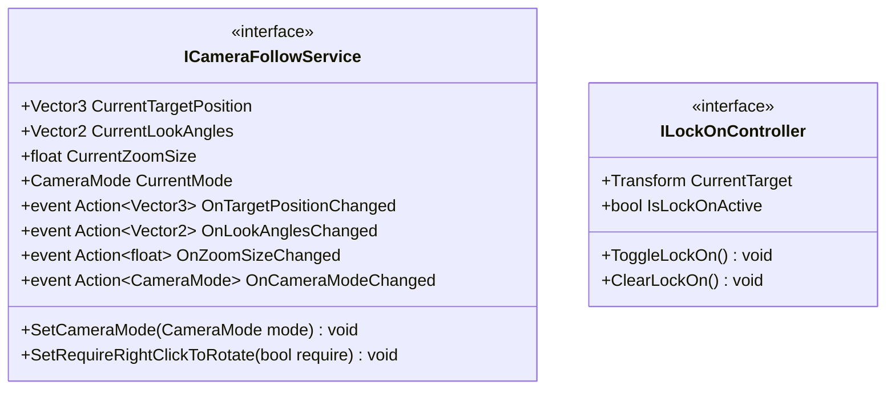

# 02. Locomotion & CameraSystem (로코모션 및 카메라 시스템)

---

## 1. VContainer 주입 관계


---

## 2. 데이터 흐름 및 호출 시퀀스



---

## 3. 인터페이스 명세 및 Public 메서드 연결점



### 연결 매핑 테이블
| 호출 주체 (Caller) | 공개 메서드 / 프로퍼티 (Public API) | 수신 주체 (Callee) | 전달/반환 데이터 (Payload) | 비고 |
|---|---|---|---|---|
| TacticalCommandLogicSystem | `ICameraFollowService.SetRequireRightClickToRotate(bool)` | CameraFollowService | `bool require` (우클릭 회전 필수 여부) | 시간 정지 모드 시점 회전 제한 |
| UnitCasterSystem | `ICameraFollowService.CurrentMode` | CameraFollowService | 반환 `CameraMode` (현재 카메라 모드) | 시점 모드별 시전 전략 교체 |
| UnitCasterSystem | `ICameraFollowService.OnCameraModeChanged` | CameraFollowService | 이벤트 구독 `Action<CameraMode>` | 숄더뷰/탑뷰 전환 감지 |
| LocomotionLogicSystem | `ILockOnController.IsLockOnActive` | PlayerLockOnController | 반환 `bool` | 전투 락온 중 이동 방향 고정 |

---

## 4. 아키텍처 점검 사항

1. **공개 프로퍼티의 중복 노출 및 인터페이스 오염**
   - `CameraFollowService.cs`: 과거 레거시 호환성을 위해 `CurrentTargetPosition`과 `TargetPosition`, `CurrentLookAngles`와 `LookAngles`가 동시에 선언되어 있습니다. 이로 인해 동일한 상태값을 읽는 호출자마다 다른 프로퍼티를 사용하여 코드 일관성이 훼손됩니다.

2. **정적 싱글톤 의존으로 인한 의존성 역전 원칙 위배**
   - `CameraFollowService`의 `LateTick()` 루프 내에서 `InputContextManager.Instance?.CurrentContext`를 직접 조회하고 있습니다.
   - VContainer가 관리하는 순수 C# 서비스임에도 정적 프로퍼티를 통해 의존성을 직접 꺼내오는 안티패턴이 잔존합니다.

3. **입력 이벤트 다중 소비 및 간섭 가능성**
   - 마우스 휠 스크롤(`onMouseWheelScrolled`)을 카메라 서비스(줌 조절)와 단위 퀵슬롯(슬롯 전환)이 동시에 구독하고 있어, 모드 전환 시 이벤트 실행 순서가 꼬일 위험이 있습니다.

---

## 5. 리팩토링 실행 프롬프트 (/goal)

```text
/goal CameraFollowService 프로퍼티 단일화 및 입력 결합도 완화 리팩토링

당신은 유니티 카메라 및 이동 시스템 전문 시니어 프로그래머입니다.
CameraFollowService의 중복 프로퍼티를 정리하고 정적 싱글톤 결합을 해소해 주세요.

[목표]
동일한 데이터를 다르게 노출하는 중복 프로퍼티를 표준화하여 인터페이스를 간결하게 정리하고, InputContextManager를 생성자 주입 구조로 변경합니다.

[요구사항]
1. 프로퍼티 표준화:
   - CurrentTargetPosition과 TargetPosition, CurrentLookAngles와 LookAngles 중 표준 명칭(CurrentTargetPosition, CurrentLookAngles)으로 단일화하고 호출처 전체 일괄 수정.
2. 입력 컨텍스트 주입 전환:
   - CameraFollowService에서 InputContextManager.Instance 정적 호출을 제거하고, IInputContextService 또는 InputContextManager를 VContainer 생성자 주입으로 전달받도록 수정.
3. 시점 제어 무결성:
   - 1인칭, 3인칭, 탑뷰 모드 전환 및 우클릭 회전 제어가 이전과 동일하게 오차 없이 동작하는지 검증.
```
