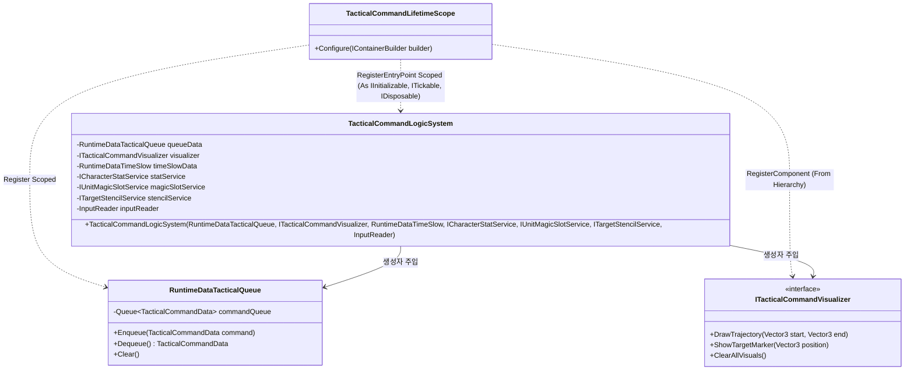
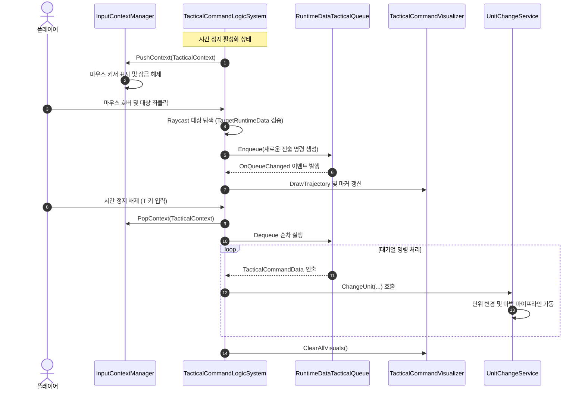
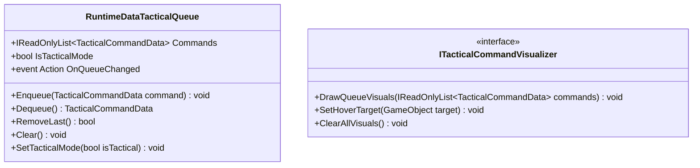

# 03. TacticalCommandSystem (전술 명령 시스템)

---

## 1. VContainer 주입 관계



---

## 2. 데이터 흐름 및 호출 시퀀스



---

## 3. 인터페이스 명세 및 Public 메서드 연결점



### 연결 매핑 테이블
| 호출 주체 (Caller) | 공개 메서드 / 프로퍼티 (Public API) | 수신 주체 (Callee) | 전달/반환 데이터 (Payload) | 비고 |
|---|---|---|---|---|
| TacticalCommandLogicSystem | `RuntimeDataTacticalQueue.Enqueue(TacticalCommandData)` | RuntimeDataTacticalQueue | `TacticalCommandData` (대상, 마법, 수치) | 명령 대기열 등록 |
| TacticalCommandLogicSystem | `RuntimeDataTacticalQueue.RemoveLast()` | RuntimeDataTacticalQueue | 반환 `bool` (제거 성공 여부) | 우클릭 탭 시 마지막 명령 취소 |
| TacticalCommandUIView | `RuntimeDataTacticalQueue.Commands` | RuntimeDataTacticalQueue | 반환 `IReadOnlyList<TacticalCommandData>` | 전술 큐 HUD 렌더링 |
| TacticalCommandLogicSystem | `ITacticalCommandVisualizer.DrawQueueVisuals(...)` | TacticalCommandVisualizer | `IReadOnlyList<TacticalCommandData>` | 전술 궤적 및 핀 시각화 |

---

## 4. 아키텍처 점검 사항

1. **직접 씬 탐색 안티패턴 집중 발생**
   - `TacticalCommandLogicSystem.cs` 내에서 VContainer 주입을 우회하여 씬 전체를 직접 검색하는 코드가 3군데 존재합니다:
     - `GetCameraFollowService()`: `UnityEngine.Object.FindAnyObjectByType<CameraMovement.CameraFollowVisualizer>()` 호출
     - `Initialize()`: `UnityEngine.Object.FindAnyObjectByType<UnitQuickSlotUIComponent>()` 호출
     - `Initialize()`: `UnityEngine.Object.FindAnyObjectByType<UnitCasterSystem>()` 호출
   - 이로 인해 씬 로드 타이밍에 따라 컴포넌트를 찾지 못할 경우 NullReferenceException이 발생할 위험이 높습니다.

2. **스코프 계층 불일치로 인한 주입 실패**
   - 전술 명령 스코프(`TacticalCommandLifetimeScope`)의 부모는 `CharacterLifetimeScope`인데, 정작 필요한 카메라 서비스는 `LocomotionLifetimeScope`에, 단위 시전 시스템은 `UnitSystemLifetimeScope`에 속해 있어 정식 주입을 받지 못하는 스코프 설계 결함이 근본 원인입니다.

3. **상호 참조 및 순환 종속 위험**
   - `TacticalCommandLogicSystem`이 `UnitCasterSystem`을 직접 조작하고, `UnitCasterSystem`도 전술 모드의 `RuntimeDataTimeSlow`와 카메라 서비스를 상호 참조하여 강한 결합이 형성되어 있습니다.

---

## 5. 리팩토링 실행 프롬프트 (/goal)

```text
/goal TacticalCommandLogicSystem 직접 씬 탐색 제거 및 DI 주입화 리팩토링

당신은 유니티 의존성 주입 아키텍처 전문 시니어 프로그래머입니다.
TacticalCommandLogicSystem 내부의 FindAnyObjectByType 씬 탐색 안티패턴을 완전히 제거해 주세요.

[목표]
런타임에 씬 전체를 뒤져 컴포넌트를 찾는 Service Locator식 우회 코드를 제거하고, VContainer의 정상적인 생성자 주입 및 인터페이스 바인딩 구조로 개편합니다.

[요구사항]
1. 씬 탐색 코드 전면 제거:
   - GetCameraFollowService() 내 FindAnyObjectByType<CameraFollowVisualizer> 제거 -> ICameraFollowService 생성자 주입으로 대체.
   - Initialize() 내 FindAnyObjectByType<UnitQuickSlotUIComponent> 및 FindAnyObjectByType<UnitCasterSystem> 제거.
2. 스코프 바인딩 연결:
   - TacticalCommandLifetimeScope 또는 상위 부모 스코프에서 해당 서비스 및 UI 컴포넌트가 적절히 바인딩되도록 설정.
3. 전술 모드 정상 작동 검증:
   - 시간 정지 진입 시 우클릭 드래그 카메라 회전, 마우스 호버 대상 타깃팅, 큐 등록 및 일괄 시전 로직이 오류 없이 동작하는지 확인.
```
