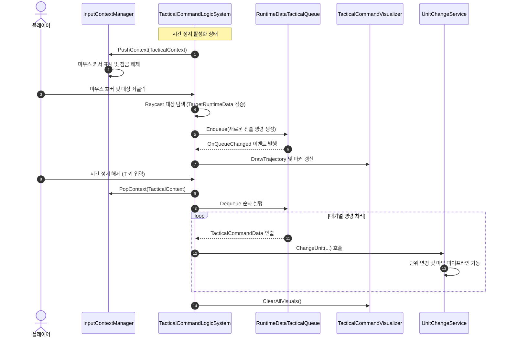
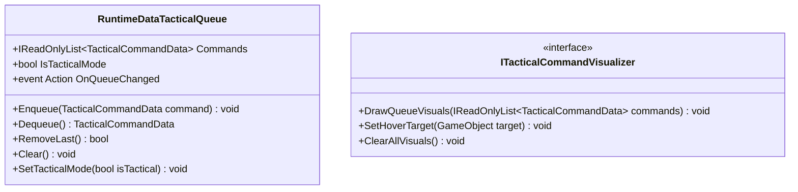

# 03. TacticalCommandSystem (전술 명령 시스템)

---

## 1. VContainer 주입 관계

---

## 2. 데이터 흐름 및 호출 시퀀스

---

## 3. 인터페이스 명세 및 Public 메서드 연결점

### 연결 매핑 테이블
| 호출 주체 (Caller) | 공개 메서드 / 프로퍼티 (Public API) | 수신 주체 (Callee) | 전달/반환 데이터 (Payload) | 비고 |
|---|---|---|---|---|
| TacticalCommandLogicSystem | `RuntimeDataTacticalQueue.Enqueue(TacticalCommandData)` | RuntimeDataTacticalQueue | `TacticalCommandData` (대상, 마법, 수치) | 명령 대기열 등록 |
| TacticalCommandLogicSystem | `RuntimeDataTacticalQueue.RemoveLast()` | RuntimeDataTacticalQueue | 반환 `bool` (제거 성공 여부) | 우클릭 탭 시 마지막 명령 취소 |
| TacticalCommandUIView | `RuntimeDataTacticalQueue.Commands` | RuntimeDataTacticalQueue | 반환 `IReadOnlyList<TacticalCommandData>` | 전술 큐 HUD 렌더링 |
| TacticalCommandLogicSystem | `ITacticalCommandVisualizer.DrawQueueVisuals(...)` | TacticalCommandVisualizer | `IReadOnlyList<TacticalCommandData>` | 전술 궤적 및 핀 시각화 |

---

## 4. 아키텍처 점검 사항
- `TacticalCommandLogicSystem`에서 형제 스코프 컴포넌트인 `CameraFollowVisualizer`, `UnitQuickSlotUIComponent`, `UnitCasterSystem`을 `FindAnyObjectByType`으로 씬 역조회하고 있습니다.
- 상위 부모 스코프나 중계 인터페이스를 통해 VContainer 정식 주입 경로로 전환해야 합니다.
