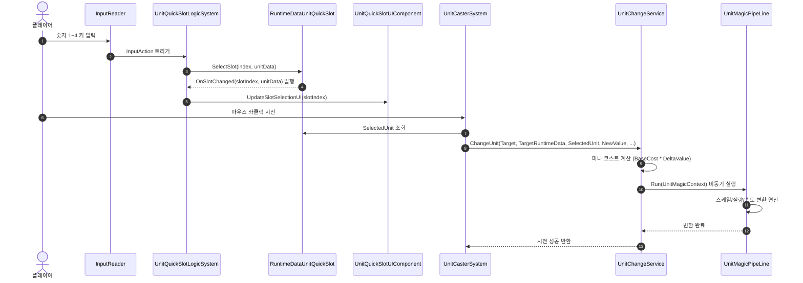
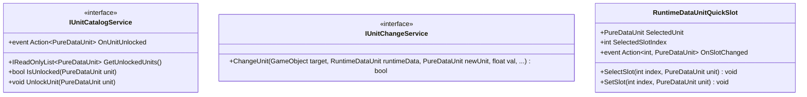

# 04. UnitSystem (단위 시스템)

---

## 1. VContainer 주입 관계

---

## 2. 데이터 흐름 및 호출 시퀀스

---

## 3. 인터페이스 명세 및 Public 메서드 연결점

### 연결 매핑 테이블
| 호출 주체 (Caller) | 공개 메서드 / 프로퍼티 (Public API) | 수신 주체 (Callee) | 전달/반환 데이터 (Payload) | 비고 |
|---|---|---|---|---|
| UnitQuickSlotLogicSystem | `IUnitCatalogService.GetUnlockedUnits()` | UnitCatalogService | 반환 `IReadOnlyList<PureDataUnit>` | 기본 슬롯 초기화 시 목록 조회 |
| UnitCasterSystem | `IUnitChangeService.ChangeUnit(...)` | UnitChangeService | `GameObject, RuntimeDataUnit, PureDataUnit, float` | 실시간 마법 시전 실행 |
| UnitQuickSlotUIComponent | `RuntimeDataUnitQuickSlot.SelectedSlotIndex` | RuntimeDataUnitQuickSlot | 반환 `int` | UI 활성 슬롯 하이라이트 |
| TacticalCommandLogicSystem | `IUnitChangeService.ChangeUnit(...)` | UnitChangeService | 전술 대기열에 담긴 데이터 | 시간 정지 해제 후 일괄 시전 |

---

## 4. 아키텍처 점검 사항
- `UnitCasterSystem.Construct`에서 `IUnitChangeService` 인터페이스를 주입받은 후 `(UnitChangeService)` 구체 클래스로 강제 다운캐스팅하고 있습니다.
- `IObjectResolver`를 주입받아 카메라 서비스와 시간 정지 데이터를 수동 역조회하는 패턴을 정식 파라미터 주입으로 개선해야 합니다.
- `MultiLockOnData` 프로퍼티의 getter 내부에서 객체를 지연 생성하는 부수 효과를 제거해야 합니다.
