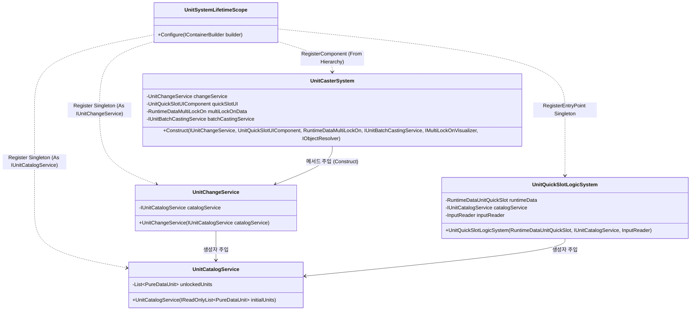
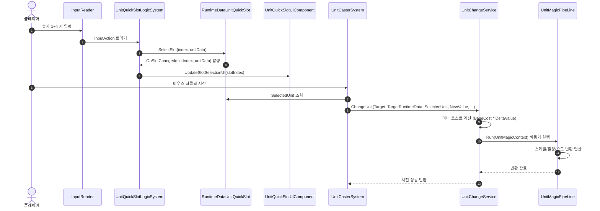

# 04. UnitSystem (단위 시스템)

---

## 1. VContainer 주입 관계



---

## 2. 데이터 흐름 및 호출 시퀀스



---

## 3. 인터페이스 명세 및 Public 메서드 연결점


### 연결 매핑 테이블
| 호출 주체 (Caller) | 공개 메서드 / 프로퍼티 (Public API) | 수신 주체 (Callee) | 전달/반환 데이터 (Payload) | 비고 |
|---|---|---|---|---|
| UnitQuickSlotLogicSystem | `IUnitCatalogService.GetUnlockedUnits()` | UnitCatalogService | 반환 `IReadOnlyList<PureDataUnit>` | 기본 슬롯 초기화 시 목록 조회 |
| UnitCasterSystem | `IUnitChangeService.ChangeUnit(...)` | UnitChangeService | `GameObject, RuntimeDataUnit, PureDataUnit, float` | 실시간 마법 시전 실행 |
| UnitQuickSlotUIComponent | `RuntimeDataUnitQuickSlot.SelectedSlotIndex` | RuntimeDataUnitQuickSlot | 반환 `int` | UI 활성 슬롯 하이라이트 |
| TacticalCommandLogicSystem | `IUnitChangeService.ChangeUnit(...)` | UnitChangeService | 전술 대기열에 담긴 데이터 | 시간 정지 해제 후 일괄 시전 |

---

## 4. 아키텍처 점검 사항

1. **인터페이스 강제 다운캐스팅으로 인한 추상화 파괴**
   - `UnitCasterSystem.Construct()` 메서드에서 `IUnitChangeService` 인터페이스로 전달받은 파라미터를 내부에서 `this.changeService = (UnitChangeService)changeService;`와 같이 구체 클래스로 강제 캐스팅하고 있습니다.
   - 이는 인터페이스 기반 설계 목적을 훼손하며, 단위 변경 서비스의 구체 구현체에 강하게 결합되는 문제를 낳습니다.

2. **IObjectResolver를 통한 런타임 수동 의존성 탐색 (Service Locator 안티패턴)**
   - `UnitCasterSystem.Construct()`에서 `IObjectResolver`를 직접 주입받은 후 `resolver.TryResolve<ICameraFollowService>()`와 `resolver.TryResolve<RuntimeDataTimeSlow>()`를 수동 호출합니다.
   - 이는 정적 타입 기반의 의존성 주입 장점을 무력화하고 런타임 누락 오류를 유발할 수 있는 대표적인 안티패턴입니다.

3. **조회 프로퍼티 내부의 지연 생성 부수 효과**
   - `MultiLockOnData` 프로퍼티의 getter에서 내부 필드가 null일 때 `new RuntimeDataMultiLockOn()`을 동적 할당합니다.
   - 단순 상태 조회가 내부 인스턴스를 임의로 생성하는 부수 효과를 지니고 있어, VContainer 컨테이너가 싱글톤으로 관리해야 할 런타임 데이터의 수명주기 일관성이 깨집니다.

---

## 5. 리팩토링 실행 프롬프트 (/goal)

```text
/goal UnitCasterSystem 다운캐스팅 제거 및 의존성 주입 정규화 리팩토링

당신은 유니티 C# 객체지향 설계 및 VContainer 전문 시니어 프로그래머입니다.
UnitSystem 내 UnitCasterSystem의 아키텍처 결함(다운캐스팅, Service Locator 패턴, 부수 효과 프로퍼티)을 리팩토링해 주세요.

[목표]
인터페이스 추상화를 온전히 보존하고, IObjectResolver 수동 Resolve를 정식 파라미터 주입으로 전환하며, 프로퍼티의 부수 효과를 제거합니다.

[요구사항]
1. 강제 다운캐스팅 제거:
   - Construct()에서 (UnitChangeService)changeService 강제 캐스팅 제거.
   - IUnitChangeService 인터페이스에 필요한 메서드가 누락되어 있다면 인터페이스 명세를 확장하여 추상화 유지.
2. IObjectResolver 수동 역조회 제거:
   - Construct() 파라미터로 ICameraFollowService와 RuntimeDataTimeSlow를 명시적으로 전달받도록 변경하고 UnitSystemLifetimeScope에서 주입 바인딩.
3. 프로퍼티 부수 효과 제거:
   - MultiLockOnData 프로퍼티 getter 내부의 지연 생성(new RuntimeDataMultiLockOn())을 제거하고, VContainer에 등록된 싱글톤 인스턴스를 주입받아 사용.
4. 기능 검증:
   - 숫자키 퀵슬롯 선택, 마우스 클릭 마법 시전, 다중 타깃 락온 기능이 정상 동작하는지 확인.
```
