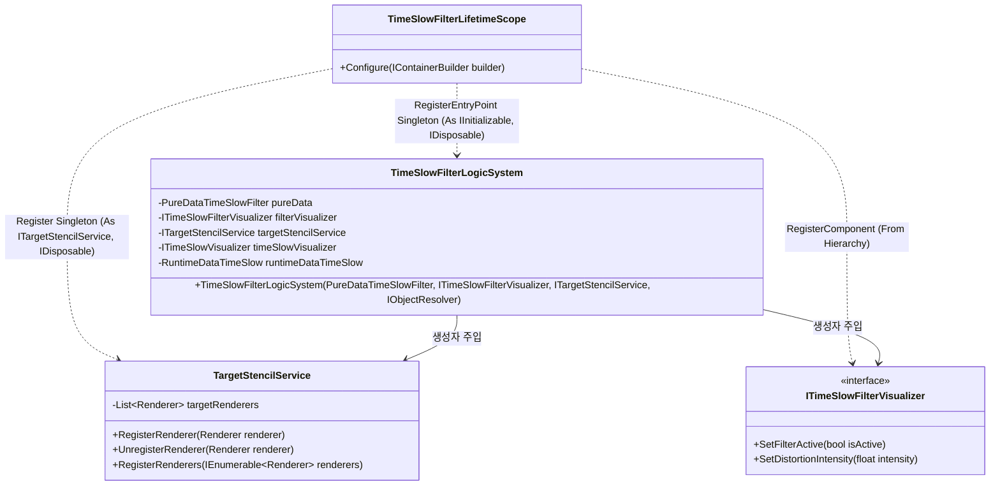
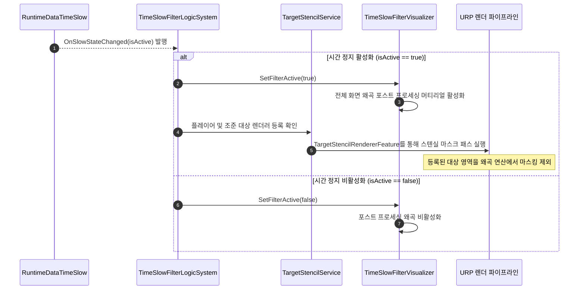
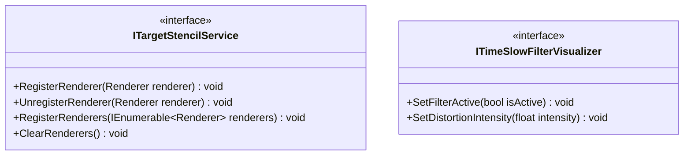

# 05. TimeSlowFilterSystem (시간 왜곡 필터 시스템)

---

## 1. VContainer 주입 관계

---

## 2. 데이터 흐름 및 호출 시퀀스

---

## 3. 인터페이스 명세 및 Public 메서드 연결점

### 연결 매핑 테이블
| 호출 주체 (Caller) | 공개 메서드 / 프로퍼티 (Public API) | 수신 주체 (Callee) | 전달/반환 데이터 (Payload) | 비고 |
|---|---|---|---|---|
| TacticalCommandLogicSystem | `ITargetStencilService.RegisterRenderer(Renderer)` | TargetStencilService | `Renderer targetRenderer` | 전술 조준 대상 스텐실 마스킹 추가 |
| TacticalCommandLogicSystem | `ITargetStencilService.UnregisterRenderer(Renderer)` | TargetStencilService | `Renderer targetRenderer` | 조준 해제 시 스텐실 마스킹 제거 |
| TimeSlowFilterLogicSystem | `ITimeSlowFilterVisualizer.SetFilterActive(bool)` | TimeSlowFilterVisualizer | `bool isActive` | 화면 전체 왜곡 셰이더 온/오프 |

---

## 4. 아키텍처 점검 사항
- `TimeSlowFilterLogicSystem` 생성자에서 `IObjectResolver`를 통해 `ITimeSlowVisualizer`와 `RuntimeDataTimeSlow`를 런타임에 수동 역조회하고 있습니다.
- `TimeSlowFilterLifetimeScope`가 `CharacterLifetimeScope`의 자식 스코프이므로, 해당 의존성들을 직접 생성자 파라미터로 명시하여 주입받도록 수정하는 것이 적합합니다.
