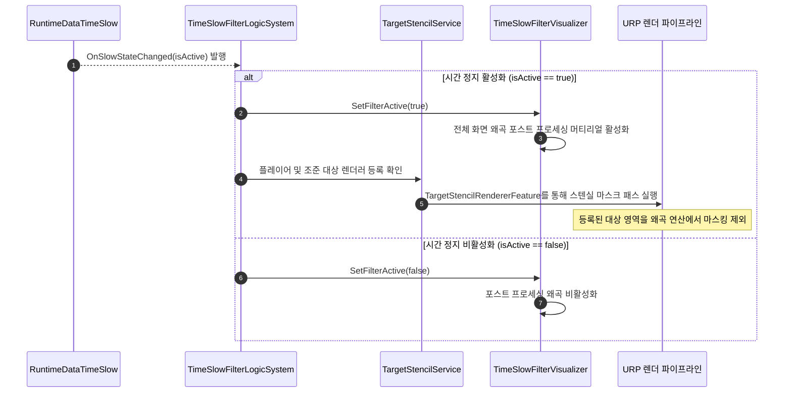
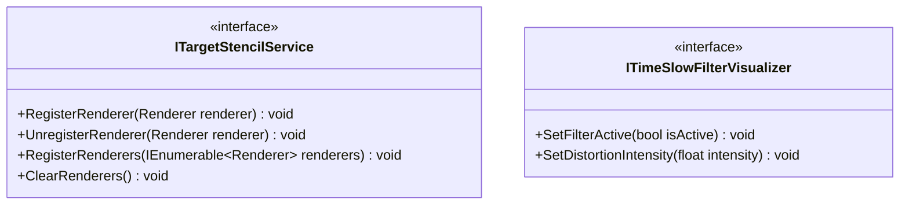

# 05. TimeSlowFilterSystem (시간 왜곡 필터 시스템)

---

## 1. VContainer 주입 관계


---

## 2. 데이터 흐름 및 호출 시퀀스



---

## 3. 인터페이스 명세 및 Public 메서드 연결점



### 연결 매핑 테이블
| 호출 주체 (Caller) | 공개 메서드 / 프로퍼티 (Public API) | 수신 주체 (Callee) | 전달/반환 데이터 (Payload) | 비고 |
|---|---|---|---|---|
| TacticalCommandLogicSystem | `ITargetStencilService.RegisterRenderer(Renderer)` | TargetStencilService | `Renderer targetRenderer` | 전술 조준 대상 스텐실 마스킹 추가 |
| TacticalCommandLogicSystem | `ITargetStencilService.UnregisterRenderer(Renderer)` | TargetStencilService | `Renderer targetRenderer` | 조준 해제 시 스텐실 마스킹 제거 |
| TimeSlowFilterLogicSystem | `ITimeSlowFilterVisualizer.SetFilterActive(bool)` | TimeSlowFilterVisualizer | `bool isActive` | 화면 전체 왜곡 셰이더 온/오프 |

---

## 4. 아키텍처 점검 사항

1. **상위 스코프 의존성에 대한 IObjectResolver 수동 역조회**
   - `TimeSlowFilterLogicSystem`의 주 생성자에서 `IObjectResolver`를 매개변수로 전달받아 `resolver.TryResolve<ITimeSlowVisualizer>()` 및 `resolver.TryResolve<RuntimeDataTimeSlow>()`를 수행하고 있습니다.
   - `TimeSlowFilterLifetimeScope`가 이미 `CharacterLifetimeScope`를 부모 스코프로 명시하고 있음에도, 생성자 파라미터로 직접 의존성을 명시하지 않고 런타임 수동 탐색을 수행하는 결함이 있습니다.

2. **이중 생성자 유지로 인한 주입 혼선**
   - VContainer 주입용 생성자(`[Inject]`)와 순수 파라미터 전달용 오버로딩 생성자가 혼재되어 있으며, 두 생성자의 파라미터 규격이 달라 향후 테스트 작성 및 주입 규칙 변경 시 혼선을 유발합니다.

3. **이벤트 리스너 누수 방지**
   - `TimeSlowVisualizer` 및 `RuntimeDataTimeSlow`의 이벤트 구독 해제가 `Dispose()`에서 처리되고 있으나, 초기화 실패 시 이벤트 핸들러가 누수되지 않도록 보다 엄격한 생명주기 관리가 필요합니다.

---

## 5. 리팩토링 실행 프롬프트 (/goal)

```text
/goal TimeSlowFilterLogicSystem 명시적 의존성 주입 구조 전환 리팩토링

당신은 VContainer 의존성 주입 아키텍처 전문 시니어 프로그래머입니다.
TimeSlowFilterLogicSystem 내의 IObjectResolver 수동 탐색 코드를 제거하고 명시적 생성자 주입 구조로 변경해 주세요.

[목표]
부모 스코프(CharacterLifetimeScope)에 이미 등록된 컴포넌트와 런타임 데이터를 자식 스코프에서 정식 생성자 파라미터로 명확히 주입받도록 개편합니다.

[요구사항]
1. IObjectResolver 파라미터 및 TryResolve 로직 제거:
   - TimeSlowFilterLogicSystem 생성자에서 IObjectResolver resolver = null 제거.
   - ITimeSlowVisualizer와 RuntimeDataTimeSlow를 생성자의 정식 파라미터로 선언.
2. 바인딩 정비:
   - TimeSlowFilterLifetimeScope의 부모 스코프 상속 관계를 점검하여 CharacterLifetimeScope로부터 두 의존성이 문제없이 주입되도록 보장.
3. 시각 효과 검증:
   - 시간 정지 활성화/비활성화 시 전체 화면 왜곡 포스트 프로세싱 셰이더 및 대상 스텐실 마스킹이 정상 작동하는지 확인.
```
