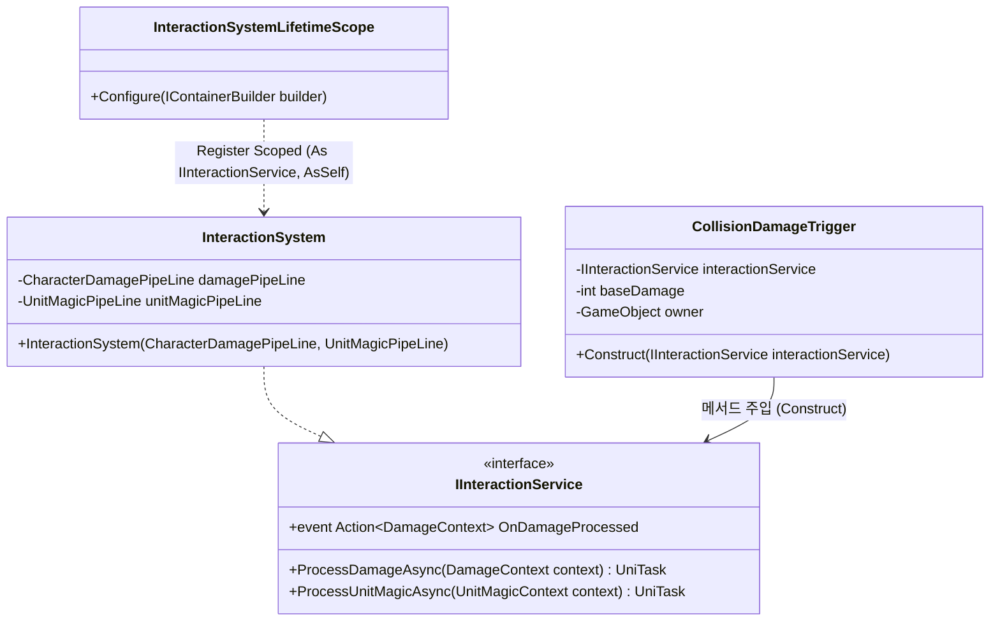
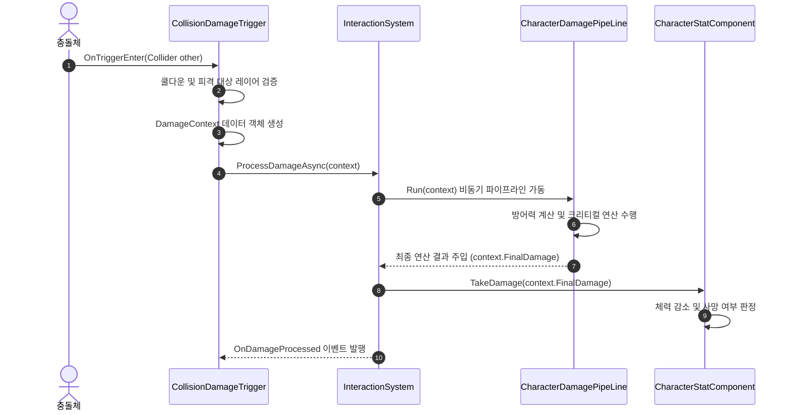
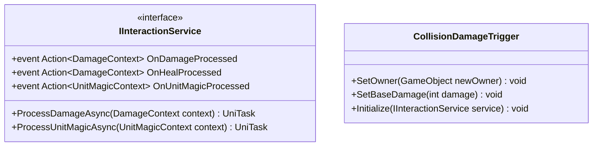

# 06. InteractionSystem (상호작용 시스템)

---

## 1. VContainer 주입 관계



---

## 2. 데이터 흐름 및 호출 시퀀스



---

## 3. 인터페이스 명세 및 Public 메서드 연결점



### 연결 매핑 테이블
| 호출 주체 (Caller) | 공개 메서드 / 프로퍼티 (Public API) | 수신 주체 (Callee) | 전달/반환 데이터 (Payload) | 비고 |
|---|---|---|---|---|
| CollisionDamageTrigger | `IInteractionService.ProcessDamageAsync(context)` | InteractionSystem | `DamageContext context` | 물리 충돌 피해 연산 요청 |
| UnitChangeService | `IInteractionService.ProcessUnitMagicAsync(context)` | InteractionSystem | `UnitMagicContext context` | 단위 변경 파이프라인 처리 |
| UnitChangeService | `CollisionDamageTrigger.SetOwner(GameObject)` | CollisionDamageTrigger | `GameObject caster` | 마법으로 변환된 물체의 소유권 이전 |

---

## 4. 아키텍처 점검 사항

1. **비동기 데미지 파이프라인의 불필요한 1프레임 지연 (UniTask.Yield)**
   - `InteractionSystem.ProcessDamageAsync(DamageContext context)` 메서드 첫 줄에 `await UniTask.Yield();`가 하드코딩되어 있습니다.
   - 물리 충돌이 발생한 프레임에 데미지가 즉시 차감되지 않고 다음 프레임으로 처리가 밀려, 빠른 물리 충돌 연쇄나 즉각적인 체력 감소가 필요한 상황에서 시각적/물리적 싱크 어긋남이 발생합니다.

2. **피격 대상 스탯 컴포넌트 역조회 결합**
   - 데미지 적용 시 피격 대상 GameObject로부터 `context.Victim.TryGetComponent<CharacterStatComponent>()`를 호출하고 있습니다.
   - 피격체가 CharacterStatComponent를 필수적으로 요구하므로, 환경 오브젝트나 파괴 가능한 구조물 등 스탯 컴포넌트가 없는 대상에 대한 유연한 데미지 처리가 제한됩니다.

3. **중복 피격 쿨다운 히스토리의 메모리 관리**
   - `CollisionDamageTrigger` 내부의 `Dictionary<GameObject, float> hitHistory`는 피격된 오브젝트가 씬에서 Destroy될 때 딕셔너리에서 자동으로 정리되지 않아 메모리 누수가 발생할 가능성이 있습니다.

---

## 5. 리팩토링 실행 프롬프트 (/goal)

```text
/goal InteractionSystem 충돌 피격 딜레이 제거 및 파이프라인 최적화 리팩토링

당신은 유니티 비동기 프로그래밍 및 물리 인터랙션 시스템 전문 시니어 프로그래머입니다.
InteractionSystem의 비동기 데미지 처리 로직에서 불필요한 프레임 지연을 제거하고 반응성을 극대화해 주세요.

[목표]
충돌 발생 프레임에서 즉각적인 데미지 산출과 피격 처리가 이루어지도록 파이프라인을 개선하고 불필요한 1프레임 지연(await UniTask.Yield())을 제거합니다.

[요구사항]
1. 프레임 지연 제거:
   - ProcessDamageAsync 내부의 await UniTask.Yield() 호출 제거.
   - 파이프라인 연산이 순수 연산인 경우 동기식 즉시 처리 메서드(ProcessDamage) 제공 또는 지연 없는 비동기 구조 확립.
2. 스탯 반영 즉시성 보장:
   - 충돌 발생 즉시 피격 대상 CharacterStatComponent의 체력 감소가 반영되어 피격 애니메이션 및 물리 넉백과의 싱크 어긋남 방지.
3. 파이프라인 무결성 검증:
   - 방어력 계산, 크리티컬 판정, 단위 마법 연동이 기존과 동일하게 정확한 수치로 처리되는지 검증.
```
