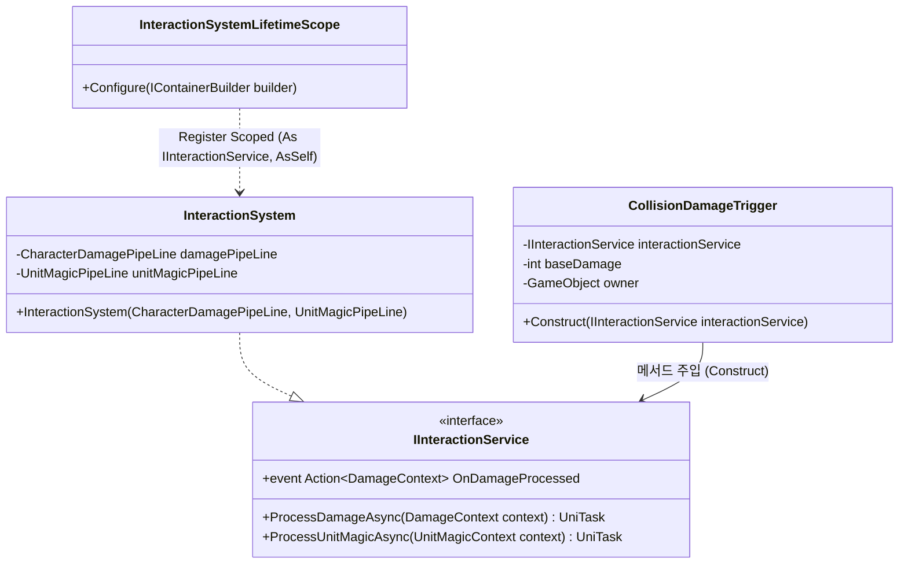
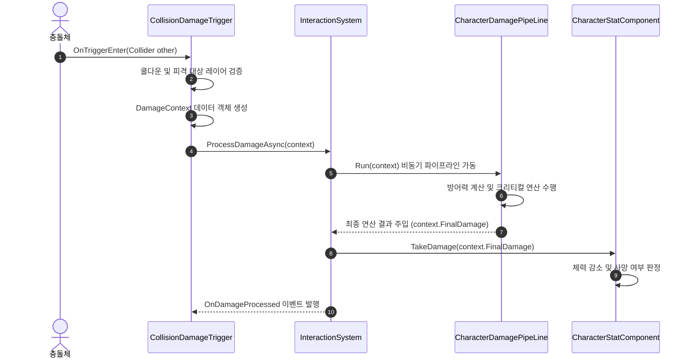
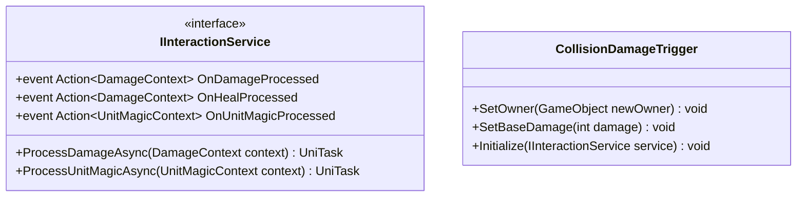

# 06. InteractionSystem (상호작용 시스템)

---

## 1. VContainer 주입 관계

---

## 2. 데이터 흐름 및 호출 시퀀스

---

## 3. 인터페이스 명세 및 Public 메서드 연결점

### 연결 매핑 테이블
| 호출 주체 (Caller) | 공개 메서드 / 프로퍼티 (Public API) | 수신 주체 (Callee) | 전달/반환 데이터 (Payload) | 비고 |
|---|---|---|---|---|
| CollisionDamageTrigger | `IInteractionService.ProcessDamageAsync(context)` | InteractionSystem | `DamageContext context` | 물리 충돌 피해 연산 요청 |
| UnitChangeService | `IInteractionService.ProcessUnitMagicAsync(context)` | InteractionSystem | `UnitMagicContext context` | 단위 변경 파이프라인 처리 |
| UnitChangeService | `CollisionDamageTrigger.SetOwner(GameObject)` | CollisionDamageTrigger | `GameObject caster` | 마법으로 변환된 물체의 소유권 이전 |

---

## 4. 아키텍처 점검 사항
- `InteractionSystem.ProcessDamageAsync` 진입부에 `await UniTask.Yield();`가 배치되어 있어, 물리 충돌 판정이 다음 프레임으로 지연되는 런타임 지연 병목이 존재합니다.
- 정밀한 물리 반응이 필요한 경우 동기 연산 경로 또는 즉시 평가 구조로의 보완이 검토되어야 합니다.
