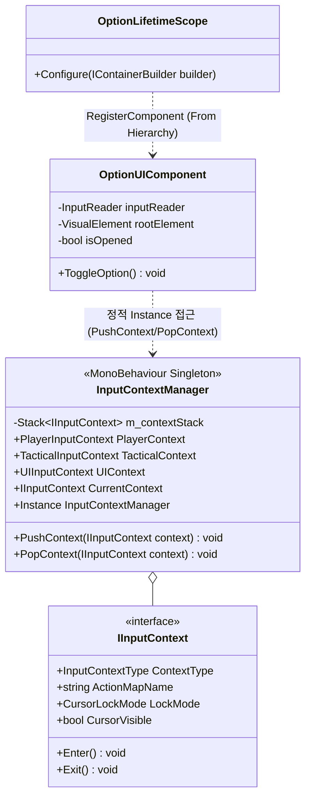
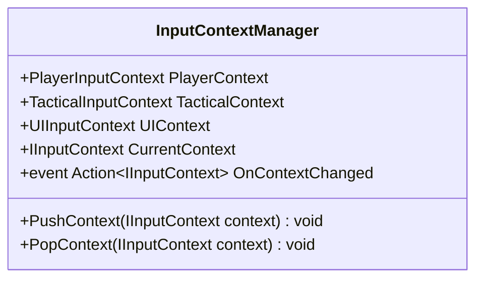

# 07. Option & InputContextSystem (옵션 및 입력 컨텍스트 시스템)

---

## 1. VContainer 및 싱글톤 관계



---

## 2. 데이터 흐름 및 호출 시퀀스

```mermaid
sequenceDiagram
    autonumber
    actor Player as 플레이어
    participant IR as InputReader
    participant OPT as OptionUIComponent
    participant ICM as InputContextManager
    participant CTX_UI as UIInputContext
    participant CTX_PL as PlayerInputContext
    participant CURSOR as Unity Cursor API

    Player->>IR: ESC 키 입력
    IR->>OPT: onCancelPerformed 이벤트 수신
    OPT->>OPT: 메뉴 UI 패널 표시 (DisplayStyle.Flex)
    OPT->>ICM: PushContext(UIContext)
    ICM->>CTX_PL: Exit() (플레이어 액션 맵 비활성화)
    ICM->>CTX_UI: Enter() (UI 액션 맵 활성화)
    ICM->>CURSOR: Cursor.lockState = None, Cursor.visible = true
    
    Note over Player: 메뉴 조작 및 설정 변경
    
    Player->>OPT: 닫기 버튼 클릭 또는 ESC 재입력
    OPT->>OPT: 메뉴 UI 패널 숨김 (DisplayStyle.None)
    OPT->>ICM: PopContext(UIContext)
    ICM->>CTX_UI: Exit()
    ICM->>CTX_PL: Enter() (플레이어 액션 맵 복구)
    ICM->>CURSOR: Cursor.lockState = Locked, Cursor.visible = false
```

---

## 3. 인터페이스 명세 및 Public 메서드 연결점



### 연결 매핑 테이블
| 호출 주체 (Caller) | 공개 메서드 / 프로퍼티 (Public API) | 수신 주체 (Callee) | 전달/반환 데이터 (Payload) | 비고 |
|---|---|---|---|---|
| OptionUIComponent | `InputContextManager.PushContext(UIContext)` | InputContextManager | `IInputContext` (UI 전용 설정) | 메뉴 오픈 시 마우스 커서 해제 |
| OptionUIComponent | `InputContextManager.PopContext(UIContext)` | InputContextManager | `IInputContext` (UI 전용 설정) | 메뉴 종료 시 이전 조작 복원 |
| TacticalCommandLogicSystem | `InputContextManager.PushContext(TacticalContext)` | TacticalCommandLogicSystem | `IInputContext` (전술 모드 설정) | 시간 정지 모드 진입 시 커서 해제 |
| CameraFollowService | `InputContextManager.CurrentContext` | InputContextManager | 반환 `IInputContext` | UI 상태 시 카메라 회전 차단 |

---

## 4. 아키텍처 점검 사항
- `InputContextManager`가 MonoBehaviour 정적 싱글톤으로 운영되고 있어 여러 시스템에서 전역 프로퍼티로 접근하고 있습니다.
- 장기적으로 VContainer 컨테이너에 등록된 관리 인터페이스(`IInputContextService`)로 추상화하여 생성자 주입을 받는 구조로 전환하는 것이 유지보수성에 유리합니다.
