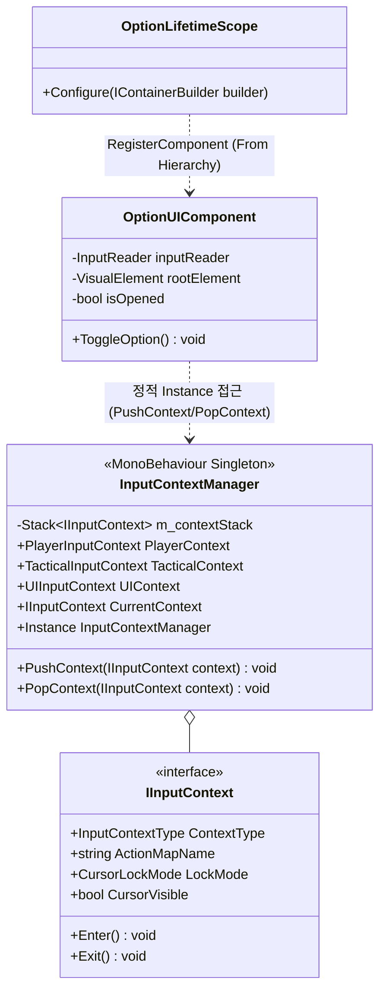
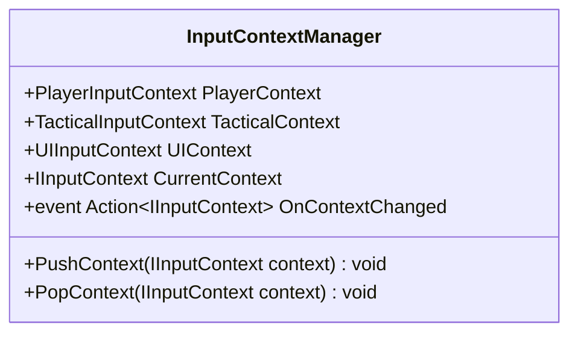

# 07. Option & InputContextSystem (옵션 및 입력 컨텍스트 시스템)

---

## 1. VContainer 및 싱글톤 관계



---

## 2. 데이터 흐름 및 호출 시퀀스

```mermaid
sequenceDiagram
    autonumber
    actor Player as 플레이어
    participant IR as InputReader
    participant OPT as OptionUIComponent
    participant ICM as InputContextManager
    participant CTX_UI as UIInputContext
    participant CTX_PL as PlayerInputContext
    participant CURSOR as Unity Cursor API

    Player->>IR: ESC 키 입력
    IR->>OPT: onCancelPerformed 이벤트 수신
    OPT->>OPT: 메뉴 UI 패널 표시 (DisplayStyle.Flex)
    OPT->>ICM: PushContext(UIContext)
    ICM->>CTX_PL: Exit() (플레이어 액션 맵 비활성화)
    ICM->>CTX_UI: Enter() (UI 액션 맵 활성화)
    ICM->>CURSOR: Cursor.lockState = None, Cursor.visible = true
    
    Note over Player: 메뉴 조작 및 설정 변경
    
    Player->>OPT: 닫기 버튼 클릭 또는 ESC 재입력
    OPT->>OPT: 메뉴 UI 패널 숨김 (DisplayStyle.None)
    OPT->>ICM: PopContext(UIContext)
    ICM->>CTX_UI: Exit()
    ICM->>CTX_PL: Enter() (플레이어 액션 맵 복구)
    ICM->>CURSOR: Cursor.lockState = Locked, Cursor.visible = false
```

---

## 3. 인터페이스 명세 및 Public 메서드 연결점



### 연결 매핑 테이블
| 호출 주체 (Caller) | 공개 메서드 / 프로퍼티 (Public API) | 수신 주체 (Callee) | 전달/반환 데이터 (Payload) | 비고 |
|---|---|---|---|---|
| OptionUIComponent | `InputContextManager.PushContext(UIContext)` | InputContextManager | `IInputContext` (UI 전용 설정) | 메뉴 오픈 시 마우스 커서 해제 |
| OptionUIComponent | `InputContextManager.PopContext(UIContext)` | InputContextManager | `IInputContext` (UI 전용 설정) | 메뉴 종료 시 이전 조작 복원 |
| TacticalCommandLogicSystem | `InputContextManager.PushContext(TacticalContext)` | TacticalCommandLogicSystem | `IInputContext` (전술 모드 설정) | 시간 정지 모드 진입 시 커서 해제 |
| CameraFollowService | `InputContextManager.CurrentContext` | InputContextManager | 반환 `IInputContext` | UI 상태 시 카메라 회전 차단 |

---

## 4. 아키텍처 점검 사항

1. **MonoBehaviour 정적 싱글톤(Instance) 패턴 고착**
   - `InputContextManager`가 `Instance` 프로퍼티를 통해 씬에 존재하지 않을 때 `[InputContextManager]` 게임오브젝트를 강제 생성하고 있습니다.
   - 이로 인해 VContainer 컨테이너가 제공하는 정상적인 컴포넌트 생명주기 관리 및 의존성 주입 체계에서 벗어나 전역 서비스 로케이터처럼 오용되는 구조적 결함이 있습니다.

2. **컨텍스트 상태 조회의 매 프레임 폴링 방식 혼재**
   - `OnContextChanged` 이벤트가 정의되어 있음에도, `CameraFollowService` 및 `MagicLockOnComponent` 등에서 매 프레임 `InputContextManager.Instance?.CurrentContext`를 직접 폴링하여 상태를 확인하고 있습니다.
   - 이벤트 기반 반응형 구조로 일원화할 필요가 있습니다.

3. **TimeScale 복원 로직의 중앙화 미흡**
   - `OptionUIComponent`에서 메뉴를 열고 닫을 때 `Time.timeScale`을 저장하고 복원하는 로직이 UI 컴포넌트 내부에 하드코딩되어 있어, 전술 모드(`TacticalCommandSystem`)의 시간 왜곡 상태와 충돌할 가능성이 존재합니다.

---

## 5. 리팩토링 실행 프롬프트 (/goal)

```text
/goal InputContextManager VContainer 관리 서비스 추상화 리팩토링

당신은 유니티 입력 시스템 및 의존성 주입 전문 시니어 프로그래머입니다.
InputContextManager의 정적 싱글톤 구조를 VContainer 컨테이너 관리 서비스 구조로 리팩토링해 주세요.

[목표]
정적 Instance 프로퍼티에 대한 전역 접근을 제거하고, IInputContextManager 인터페이스를 정의하여 필요한 시스템에 생성자 주입으로 전달합니다.

[요구사항]
1. 인터페이스 추상화:
   - IInputContextManager 인터페이스 선언 (PushContext, PopContext, CurrentContext, Context 변경 이벤트 등).
   - InputContextManager가 해당 인터페이스를 구현하도록 수정.
2. VContainer 등록 및 싱글톤 제거:
   - RootLifetimeScope 또는 통합 스코프에서 RegisterComponent 또는 Register<IInputContextManager>로 등록.
   - OptionUIComponent, TacticalCommandLogicSystem, CameraFollowService 등에서 정적 Instance 접근 대신 생성자 주입 사용.
3. 컨텍스트 전환 무결성:
   - 인게임, 시간 정지 전술 모드, 옵션 UI 간의 마우스 커서 상태 및 액션 맵 전환이 완벽하게 동작하는지 검증.
```
