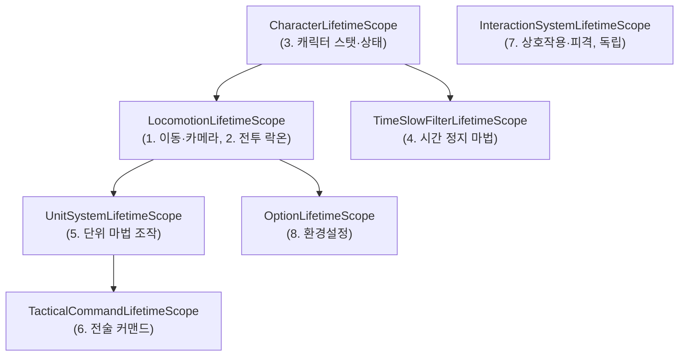
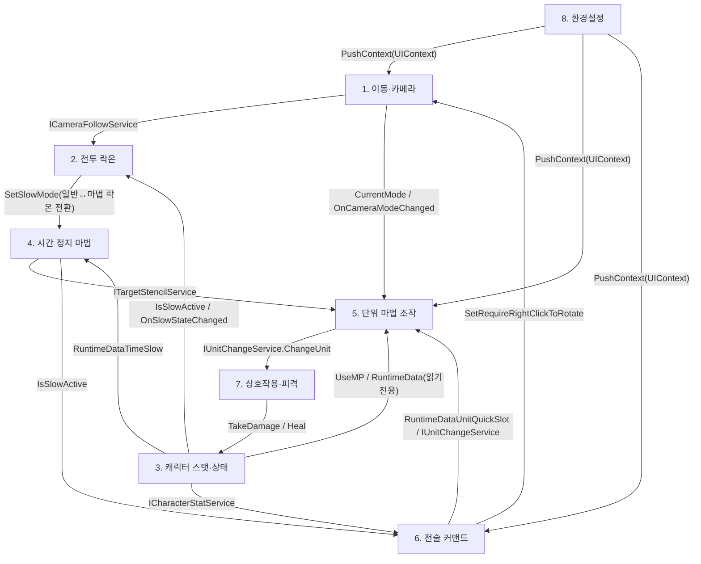

# 00. 전체 시스템 개요 (Overview)

> 작성일: 2026-09-15
> 기준: 2026-09-15 현재 `Assets/02.System` 실제 코드 및 VContainer LifetimeScope 계층 구조
> 범위: 플레이어가 체감하는 8개 시스템 (내부 구현 클래스 단위가 아닌 경험 단위)

---

## 1. 시스템 목록

| # | 시스템명 | 문서 |
|---|---|---|
| 1 | 이동 · 카메라 시스템 | [MovementCameraSystem.md](./MovementCameraSystem.md) |
| 2 | 전투 락온 시스템 | [CombatLockOnSystem.md](./CombatLockOnSystem.md) |
| 3 | 캐릭터 스탯 · 상태 시스템 | [CharacterStatSystem.md](./CharacterStatSystem.md) |
| 4 | 시간 정지(불릿타임) 마법 시스템 | [TimeSlowMagicSystem.md](./TimeSlowMagicSystem.md) |
| 5 | 단위(Unit) 마법 조작 시스템 | [UnitMagicSystem.md](./UnitMagicSystem.md) |
| 6 | 전술 커맨드(예약 시전) 시스템 | [TacticalCommandSystem.md](./TacticalCommandSystem.md) |
| 7 | 상호작용 · 피격 시스템 | [InteractionSystem.md](./InteractionSystem.md) |
| 8 | 환경설정 · 일시정지 메뉴 시스템 | [OptionSystem.md](./OptionSystem.md) |

---

## 2. VContainer LifetimeScope 계층 (실제 부모-자식 관계)

`CharacterLifetimeScope`가 사실상 루트 역할을 하며, `InteractionSystemLifetimeScope`만 독립 스코프로 남아있다.

**근거**:
- `Assets/02.System/00.Movement/LocomotionLifetimeScope.cs:14-18` — `parentReference = ParentReference.Create<CharacterLifetimeScope>();`
- `Assets/02.System/01.UnitSystem/UnitSystemLifetimeScope.cs:25-29` — `parentReference = ParentReference.Create<Movement.RefactoredLocomotion.LocomotionLifetimeScope>();`
- `Assets/02.System/06.TacticalCommand/TacticalCommandLifetimeScope.cs:21-24` — `parentReference = ParentReference.Create<UnitSystem.UnitSystemLifetimeScope>();`
- `Assets/02.System/04.OptionSystem/OptionLifetimeScope.cs:12-15` — `parentReference = ParentReference.Create<Movement.RefactoredLocomotion.LocomotionLifetimeScope>();`
- `Assets/02.System/05.TimeSlowFilter/TimeSlowFilterLifetimeScope.cs` — parent `CharacterLifetimeScope`
- `Assets/02.System/02.CharacterSystem/CharacterLifetimeScope.cs`, `Assets/02.System/03.InteractionSystem/InteractionSystemLifetimeScope.cs` — `parentReference` 미지정 (독립 루트)

---

## 3. 플레이어 경험 시스템 간 상호작용 관계

> 각 화살표의 구체적 메서드 시그니처와 파일 근거는 해당 시스템 문서(1~8)의 "다른 시스템과의 상호작용" 절 참고.

---

## 4. 공통 인프라 (플레이어 체감 시스템은 아니지만 8개 시스템이 공유)

- **입력 컨텍스트 관리**: `Assets/02.System/99.Common/Input/IInputContextManager.cs`, `InputContextManager.cs` — Player/Tactical/UI 3개 컨텍스트 스택으로 마우스 커서 상태 및 액션맵 전환을 중계. 8개 시스템 대부분이 이 인터페이스를 주입받아 사용.
- **오브젝트 풀링**: `Assets/02.System/99.Common/Pooling/` — 현재 코드베이스에서 실사용 연결부 확인 안 됨 (인프라만 존재).
