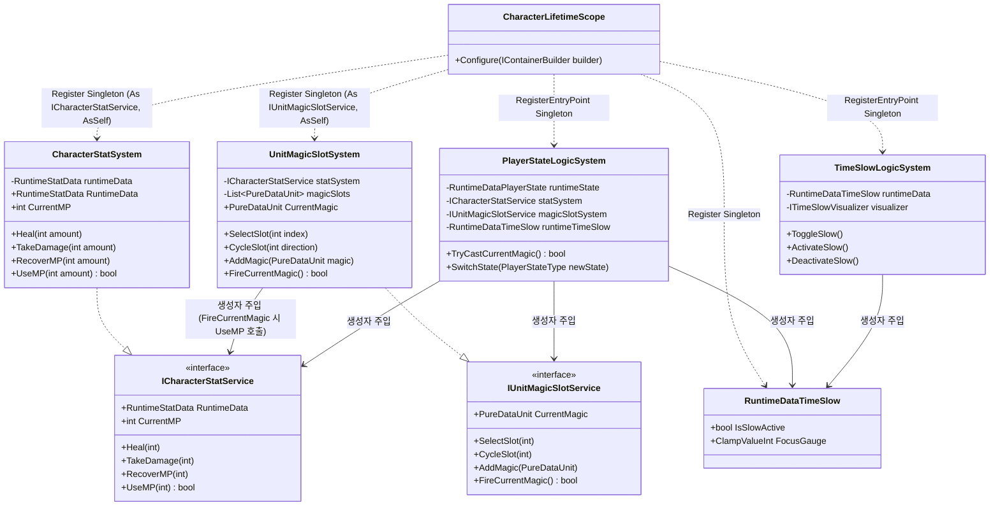
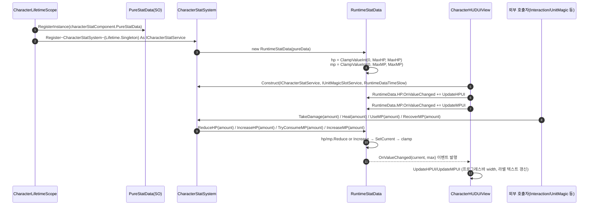

# 3. 캐릭터 스탯 · 상태 시스템 (CharacterStatSystem)

> 작성일: 2026-09-15 / 기준 코드: `Assets/02.System/02.CharacterSystem/`
> 플레이어 체감 범위: 체력/마나 게이지, 상태(일반/시전/시간정지) 전환, 마법 슬롯 선택. (시간 정지의 화면 연출은 "4. 시간 정지 마법 시스템" 문서 참고)

---

## 1. 개요

체력(HP)·마나(MP)·이동속도·진영을 보관하는 `RuntimeStatData`를 `CharacterStatSystem`이 캡슐화해서 `ICharacterStatService`로 노출한다. `UnitMagicSlotSystem`은 장착 마법 슬롯을 관리하고, `PlayerStateLogicSystem`은 Normal/Casting/TimeSlow 3개 상태를 전환하는 상태 머신이며, `TimeSlowLogicSystem`은 시간 정지 게이지(FocusGauge)와 On/Off를 관리한다.

---

## 2. 데이터 흐름 (PureStatData → RuntimeStatData → HUD)

`PureStatData`(ScriptableObject, 읽기 전용 원본)에서 `RuntimeStatData`(순수 C#, 가변 런타임 값)가 생성되고, `RuntimeStatData.HP`/`.MP`는 `IReadOnlyClampValueInt`로 봉인되어 있어 외부는 `ICharacterStatService`의 공식 메서드(TakeDamage/Heal/UseMP/RecoverMP)를 거쳐야만 값을 바꿀 수 있다 (`Assets/02.System/02.CharacterSystem/01.Logic/CharacterStatSystem.cs:26-44`, `Assets/02.System/02.CharacterSystem/00.Data/RuntimeStatData.cs:14-15, 87-89`).

**근거**:
- `Assets/02.System/02.CharacterSystem/CharacterLifetimeScope.cs:27-40` — PureStatData/CharacterStatSystem 등록
- `Assets/02.System/02.CharacterSystem/00.Data/RuntimeStatData.cs:43-61` — 생성자에서 `ClampValueInt` 초기화
- `Assets/02.System/02.CharacterSystem/03.UI/CharacterHUDUIView.cs:100-101` — `statSystem.RuntimeData.HP.OnValueChanged += UpdateHPUI;`
- `Assets/02.System/02.CharacterSystem/01.Logic/CharacterStatSystem.cs:26-39` — `Heal`/`TakeDamage`/`RecoverMP`가 `runtimeData.IncreaseHP/ReduceHP/IncreaseMP` 호출

---

## 3. 다른 시스템과의 상호작용

| 호출 시스템 | 호출 API (public) | 시그니처 | 근거 파일:라인 |
|---|---|---|---|
| 7. 상호작용·피격 | `ICharacterStatService.TakeDamage` | `void TakeDamage(int amount)` | `Assets/02.System/03.InteractionSystem/01.Logic/InteractionSystem.cs:51` — `statService?.TakeDamage(context.FinalDamage);` |
| 7. 상호작용·피격 | `ICharacterStatService.Heal` | `void Heal(int amount)` | `Assets/02.System/03.InteractionSystem/01.Logic/InteractionSystem.cs:75` — `statService?.Heal(context.RawDamage);` |
| 7. 상호작용·피격 | `ICharacterStatService.UseMP` | `bool UseMP(int amount)` | `Assets/02.System/03.InteractionSystem/01.Logic/InteractionSystem.cs:101` — `statService?.UseMP(context.RequiredMana);` |
| 6. 전술 커맨드 | `ICharacterStatService.CurrentMP` | `int CurrentMP { get; }` | `Assets/02.System/06.TacticalCommand/01.Logic/TacticalCommandLogicSystem.cs:311` — `int availableMana = statService != null ? statService.CurrentMP : 100;` |
| 6. 전술 커맨드 | `ICharacterStatService.UseMP` | `bool UseMP(int amount)` | `Assets/02.System/06.TacticalCommand/01.Logic/TacticalCommandLogicSystem.cs:348` — `statService.UseMP(queueData.TotalEstimatedManaCost);` |
| 6. 전술 커맨드 | `IUnitMagicSlotService.CurrentMagic` | `PureDataUnit CurrentMagic { get; }` | `Assets/02.System/06.TacticalCommand/01.Logic/TacticalCommandLogicSystem.cs:439-441` — `if (magicSlotService != null && magicSlotService.CurrentMagic != null) return magicSlotService.CurrentMagic;` |
| 5. 단위 마법 조작 | `RuntimeDataTimeSlow`(생성자 주입) | `UnitCasterSystem(..., RuntimeDataTimeSlow timeSlowData = null)` | `Assets/02.System/01.UnitSystem/01.Logic/UnitCasterSystem.cs:27, 52` |
| 5. 단위 마법 조작 | `RuntimeDataTimeSlow`(생성자 주입) | `AimLockOnCastingStrategy(..., RuntimeDataTimeSlow timeSlowData)` | `Assets/02.System/01.UnitSystem/01.Logic/Strategy/AimLockOnCastingStrategy.cs:15, 29` |
| 4. 시간 정지 마법 | `RuntimeDataTimeSlow`(생성자 주입) | `TargetStencilService(RuntimeDataTimeSlow runtimeDataTimeSlow = null, ...)` | `Assets/02.System/05.TimeSlowFilter/01.Logic/TargetStencilService.cs:16, 40` |
| 2. 전투 락온 | `ITimeSlowVisualizer.OnSlowStateChanged`(구독) | `event Action<bool> OnSlowStateChanged` | `Assets/02.System/00.Movement/02.Visualizer/00.Locomotion/PlayerLockOnController.cs:56` — `_timeSlowVisualizer.OnSlowStateChanged += HandleSlowStateChanged;` (일반 락온 ↔ 마법 락온 전환에 사용) |

`RuntimeDataTimeSlow`는 인터페이스가 아닌 구체 클래스이지만 `CharacterLifetimeScope`에 `Lifetime.Singleton`으로 등록되어(라인 52) 여러 자식 스코프(Locomotion→UnitSystem→TacticalCommand, TimeSlowFilter)에 생성자 주입으로 전파된다.

---

## 4. mermaid 검증 로그

`npx -y @mermaid-js/mermaid-cli`로 위 2개 다이어그램을 각각 렌더링해 문법을 검증했다 (결과는 세션 대화 기록에 원문 로그로 남김).
