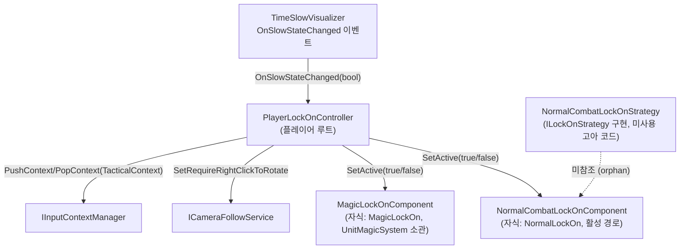
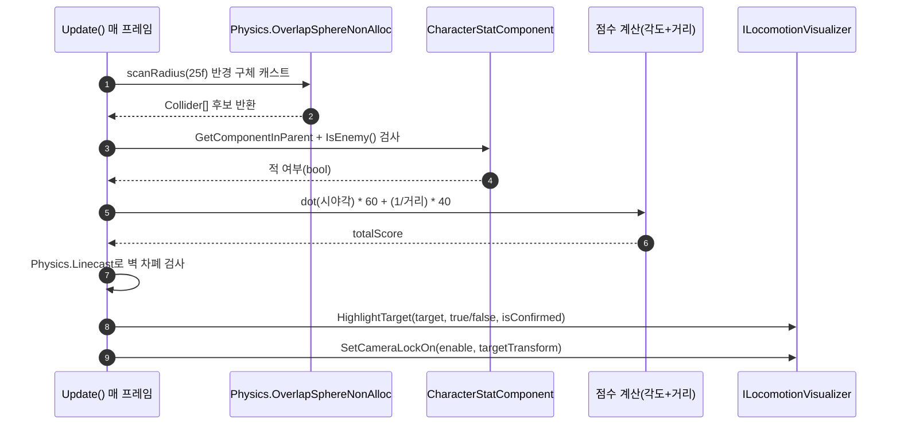

# 2. 전투 락온 시스템 (Combat Lock-On System)

> 작성일: 2026-09-15
> 범위: 플레이어가 근접/원거리 전투 중 적을 자동으로 락온·조준하는 경험. 이동/카메라 자체 구현(전략 패턴, 카메라 모드)은 [MovementCameraSystem.md](./MovementCameraSystem.md) 참고. 시간 정지 중 마법 타깃팅(`MagicLockOnComponent`)은 [UnitMagicSystem.md](./UnitMagicSystem.md) 참고.

---

## 1. 개요

이 시스템은 **일반 전투(시간 정지 아님) 중 최적 적 1명을 자동으로 탐색·하이라이트·락온**하는 기능을 담당한다.

`PlayerLockOnController`(플레이어 루트에 부착)가 컨트롤 타워 역할을 하며, `TimeSlowVisualizer.OnSlowStateChanged` 이벤트를 구독해 상태에 따라 자식 오브젝트 중 하나만 활성화한다:
- 평시(시간 정지 아님): `NormalCombatLockOnComponent` 활성화 — 이 문서의 대상
- 시간 정지 중: `MagicLockOnComponent` 활성화 — [UnitMagicSystem.md](./UnitMagicSystem.md) 소관

**중요 발견 (근거: 코드 grep)**: `Assets/02.System/00.Movement/01.Logic/00.Locomotion/Strategy/NormalCombatLockOnStrategy.cs`는 `ILockOnStrategy`를 구현한 별도의 락온 로직 클래스로 존재하지만, 프로젝트 전체에서 `ILockOnStrategy` 인터페이스를 참조하는 곳은 자기 자신의 선언부(`Strategy/ILockOnStrategy.cs`)뿐이고 `LocomotionLogicSystem`이나 어떤 LifetimeScope에서도 `NormalCombatLockOnStrategy`가 생성·등록되지 않는다. 즉 **실제로 씬에서 동작하는 락온 로직은 `NormalCombatLockOnComponent`(MonoBehaviour)이며, `NormalCombatLockOnStrategy`는 사용되지 않는 고아(orphan) 코드**다. 두 클래스는 탐색 반경(25f), 점수 계산식(`angleScore = dot*60f`, `distanceScore = (1/dist)*40f`), 벽 차폐 판정(`Physics.Linecast`) 로직이 거의 동일하다 — 과거 리팩토링 중 컴포넌트 방식으로 이전되며 남은 중복으로 추정된다.



---

## 2. 데이터 흐름 (전용 SO/PureData 없음)

이 시스템은 전용 ScriptableObject나 PureData/RuntimeData 클래스를 갖지 않는다(`NormalCombatLockOnComponent`는 `[SerializeField] private float scanRadius`만 인스펙터 노출 필드로 가짐). 대신 **매 프레임 물리 스캔 → 점수 계산 → 하이라이트/확정**으로 이어지는 판정 흐름을 시퀀스 다이어그램으로 대체한다.



**근거**: `Assets/02.System/00.Movement/02.Visualizer/00.Locomotion/NormalCombatLockOnComponent.cs:73` (`Physics.OverlapSphereNonAlloc`), `:89-90`(`CharacterStatComponent`/`IsEnemy()`), `:113-116`(점수 계산), `:119-125`(`Physics.Linecast`), `:139,147,56,60`(`HighlightTarget`/`SetCameraLockOn` 호출).

---

## 3. 다른 시스템과의 상호작용

### 3-1. 캐릭터 스탯·상태 시스템 → 이 시스템 (상태 전환 트리거)

`PlayerLockOnController`는 `TimeSlowVisualizer.OnSlowStateChanged` 이벤트를 구독해 `HandleSlowStateChanged` → `SetSlowMode(bool)`를 호출한다.

```csharp
// Assets/02.System/00.Movement/02.Visualizer/00.Locomotion/PlayerLockOnController.cs:143-146
private void HandleSlowStateChanged(bool isSlowActive)
{
    SetSlowMode(isSlowActive);
}
```
구독 지점: 같은 파일 `:56` (`_timeSlowVisualizer.OnSlowStateChanged += HandleSlowStateChanged;`), `:72-73`.

### 3-2. 이 시스템 → 이동·카메라 시스템

```csharp
// Assets/02.System/00.Movement/02.Visualizer/00.Locomotion/PlayerLockOnController.cs:148-170 (SetSlowMode 내부)
_cameraFollowService?.SetRequireRightClickToRotate(true);   // :155 (시간정지 진입 시)
_cameraFollowService?.SetRequireRightClickToRotate(false);  // :164 (시간정지 해제 시)
```
`_cameraFollowService`는 `CameraMovement.ICameraFollowService` 타입으로, `Construct()`(:31-43)에서 `[Inject]` 생성자 주입되며, 미주입 시 `EnsureDependencies()`(:77-84)가 `FindAnyObjectByType<CameraFollowVisualizer>()`로 폴백 탐색한다. 메서드 시그니처는 `Assets/02.System/00.Movement/01.Logic/01.CameraMovement/Interface/ICameraFollowService.cs`에 `void SetRequireRightClickToRotate(bool require);`로 정의되어 있다.

### 3-3. 이 시스템 → 공용 입력 컨텍스트 인프라

```csharp
// PlayerLockOnController.cs:154, 163
_inputContextManager?.PushContext(_inputContextManager.TacticalContext);  // 시간정지 진입
_inputContextManager?.PopContext(_inputContextManager.TacticalContext);   // 시간정지 해제
```
`_inputContextManager`는 `Common.InputSystem.IInputContextManager` 타입(`Construct()` 파라미터 `:34`). `PushContext(IInputContext)`/`PopContext(IInputContext)` 시그니처는 `Assets/02.System/99.Common/Input/IInputContextManager.cs`에 정의.

### 3-4. `ILockOnController` 계약 (다른 시스템이 이 시스템을 호출하는 지점)

```csharp
// Assets/02.System/00.Movement/02.Visualizer/00.Locomotion/ILockOnController.cs:6-10
public interface ILockOnController
{
    void ToggleLockOn();
    void SetSlowMode(bool isSlowActive);
}
```
`PlayerLockOnController`가 이를 구현하며(`:17`), `LocomotionLifetimeScope`가 `builder.RegisterComponentInHierarchy<PlayerLockOnController>().As<ILockOnController>();`로 등록한다(이동·카메라 시스템 문서 참고). 마우스 휠 클릭 등 외부 입력이 이 인터페이스를 통해 `ToggleLockOn()`을 호출하면 `_currentActiveLockOn?.ToggleLockOn()`(`:175`)으로 현재 활성 락온 컴포넌트(Normal 또는 Magic)에 위임된다.

---

## 4. 검증 로그 (mermaid-cli)

두 mermaid 블록을 각각 `.mmd`로 추출해 `npx -y @mermaid-js/mermaid-cli`로 렌더링 검증함 (하단 "실행 로그" 절 참고).
