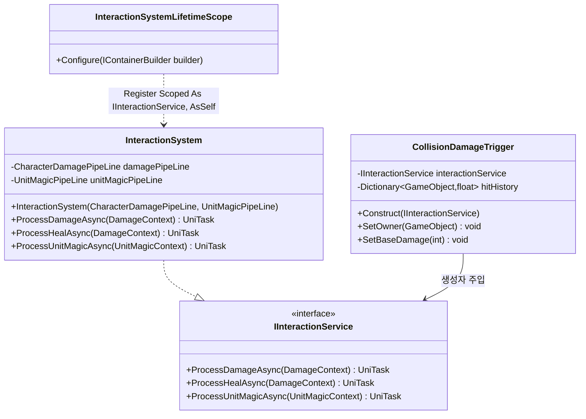
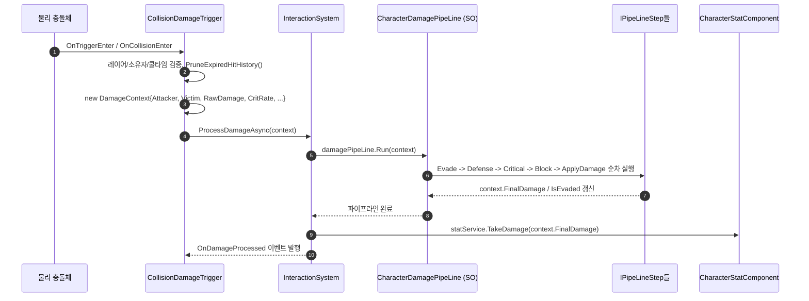

# 7. 상호작용 · 피격 시스템 (Interaction System)

> 작성일: 2026-09-15
> 대상 코드: `Assets/02.System/03.InteractionSystem/`, `Assets/PipeLine/` (파이프라인 SO 자산)

---

## 1. 개요

물리 충돌(투사체/근접 판정)이 발생했을 때 데미지·힐 연산을 `ScriptableObject` 기반 파이프라인(`CharacterDamagePipeLine`)에 위임해 실행하고, 최종 결과를 캐릭터 스탯 시스템(`ICharacterStatService`)에 적용하는 시스템입니다. `InteractionSystemLifetimeScope`는 다른 어떤 스코프에도 부모로 연결되지 않은 **독립 스코프**입니다 (`Assets/02.System/03.InteractionSystem/InteractionSystemLifetimeScope.cs`에 `parentReference` 지정 없음).

오늘 세션에서 두 가지가 수정되었습니다:
1. `ProcessDamageAsync`/`ProcessHealAsync` 내부의 불필요한 `await UniTask.Yield();` 1프레임 지연 제거 (충돌 발생 프레임에 즉시 데미지 반영).
2. `CollisionDamageTrigger.hitHistory` 딕셔너리가 파괴/만료된 대상에 대해 무한 누적되던 메모리 누수를 `PruneExpiredHitHistory()`로 방지.

---

## 2. VContainer 주입 관계



**근거**: `Assets/02.System/03.InteractionSystem/InteractionSystemLifetimeScope.cs:21` — `builder.Register<Logic.InteractionSystem>(Lifetime.Scoped).As<IInteractionService>().AsSelf();`

---

## 3. 데이터 단위 및 흐름

이 시스템 고유의 `PureData` SO는 없지만, **파이프라인 자산 자체가 ScriptableObject**입니다: `Assets/PipeLine/CharacterDamage/CharacterDamagePipeLine.cs:8` — `public class CharacterDamagePipeLine : PipeLineSo<DamageContext>`이며 `PipeLineSo<T>`는 `Assets/PipeLine/PipeLineBase/PipeLineSO.cs:17`에서 `ScriptableObject`를 상속합니다. `InteractionSystemLifetimeScope`가 인스펙터에 직렬화된 이 SO를 `RegisterInstance`로 주입합니다. `DamageContext`(`Assets/PipeLine/Contexts/DamageContext.cs`)는 SO가 아닌 순수 런타임 데이터 컨테이너로, 파이프라인의 각 `IPipeLineStep`(BlockStep/CriticalStep/DefenseStep/EvadeStep/EvasionStep/ApplyDamageStep)을 통과하며 값이 갱신됩니다.



**근거**: `Assets/02.System/03.InteractionSystem/01.Logic/CollisionDamageTrigger.cs:89-113`(HandleCollision→ProcessDamageAndDestroyAsync), `Assets/02.System/03.InteractionSystem/01.Logic/InteractionSystem.cs:29-51`(ProcessDamageAsync→damagePipeLine.Run→TakeDamage)

---

## 4. 다른 시스템과의 상호작용

### 4-1. Interaction → 캐릭터 스탯·상태 시스템 (호출)
`InteractionSystem`이 피격/힐 처리 후 `CharacterStatComponent`를 통해 `ICharacterStatService`의 공식 메서드를 호출합니다.

| 호출 위치 | 메서드 | 파일:라인 |
|---|---|---|
| `ProcessDamageAsync` | `ICharacterStatService.TakeDamage(int amount)` | `Assets/02.System/03.InteractionSystem/01.Logic/InteractionSystem.cs:51` — `statService?.TakeDamage(context.FinalDamage);` |
| `ProcessHealAsync` | `ICharacterStatService.Heal(int amount)` | `Assets/02.System/03.InteractionSystem/01.Logic/InteractionSystem.cs:75` — `statService?.Heal(context.RawDamage);` |
| `ProcessUnitMagicAsync` | `ICharacterStatService.UseMP(int amount)` | `Assets/02.System/03.InteractionSystem/01.Logic/InteractionSystem.cs:101` — `statService?.UseMP(context.RequiredMana);` |

`statService`는 `Assets/02.System/02.CharacterSystem/01.Logic/CharacterStatComponent.cs:19` — `public ICharacterStatService StatService => StatSystem;` 를 통해 획득합니다.

### 4-2. 단위(Unit) 마법 조작 시스템 → Interaction (호출)
`UnitChangeService.ChangeUnit(...)`이 대상 오브젝트의 `CollisionDamageTrigger`(Interaction 시스템 소속) 소유권을 직접 갱신합니다.

- 시그니처: `Assets/02.System/03.InteractionSystem/01.Logic/CollisionDamageTrigger.cs:49` — `public void SetOwner(GameObject newOwner)`
- 호출부: `Assets/02.System/01.UnitSystem/01.Logic/UnitChangeService.cs:89-101` (`UpdateCollisionTriggerOwner`) — `targetObject.GetComponentsInParent<CollisionDamageTrigger>(true)` / `GetComponentsInChildren<CollisionDamageTrigger>(true)`로 트리거를 찾아 각각 `trigger.SetOwner(casterGameObject)` 호출. 단위 변환으로 대상이 "무기화"될 때 피해 소유자를 시전자로 강탈하는 용도.

### 4-3. ⚠ 검증 결과: 정의는 있으나 실제로는 호출되지 않는 API
`grep -rn "ProcessUnitMagicAsync\|ProcessHealAsync" Assets/02.System`로 전수 조사한 결과, `IInteractionService.ProcessUnitMagicAsync`와 `ProcessHealAsync`는 `InteractionSystem.cs`에 구현만 되어 있을 뿐 **다른 어떤 파일에서도 호출되지 않습니다.** 실제로 `UnitChangeService.ChangeUnit()`(`Assets/02.System/01.UnitSystem/01.Logic/UnitChangeService.cs:42-58`)은 `IInteractionService`를 거치지 않고 `PipeLine.UnitMagic.UnitMagicPipeLine`을 파라미터로 직접 전달받아 `pipeLine.Run(context).Forget()`으로 자체 실행합니다. 즉 단위 마법 시전 시 마나 소비/데미지 파이프라인은 Interaction 시스템을 경유하지 않고 UnitSystem이 파이프라인 SO를 직접 구동하는 별도 경로이며, `IInteractionService.ProcessUnitMagicAsync`는 현재 미사용(dead code) 상태입니다. `ProcessDamageAsync`만 실제 사용 경로(`CollisionDamageTrigger`)를 가지고 있습니다.

---

## 5. mermaid 검증 로그

`npx -y @mermaid-js/mermaid-cli`로 위 2개 블록을 각각 렌더링 검증함 (로컬 캐시로 빠르게 실행됨).

```
=== classDiagram (2절) ===
Generating single mermaid chart
(성공 — interaction_class.svg 생성 확인)

=== sequenceDiagram (3절) ===
Generating single mermaid chart
(성공 — interaction_seq.svg 생성 확인)
```
