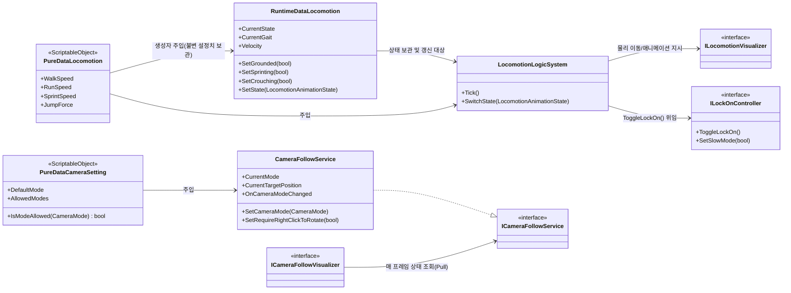
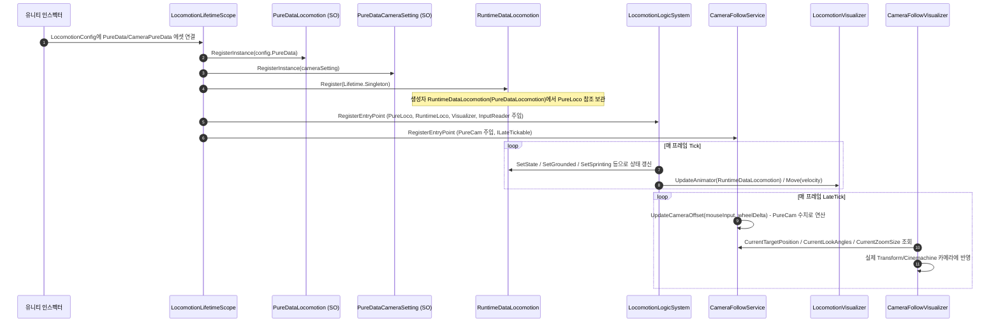

# 1. 이동 · 카메라 시스템 (Movement & Camera System)

> 작성일: 2026-09-15 기준 실제 코드 분석
> 플레이어 체감: WASD 이동, 마우스 시점 회전/줌, 1인칭·3인칭·탑뷰 카메라 전환

---

## 1. 개요 다이어그램



**근거**
- `Assets/02.System/00.Movement/01.Logic/00.Locomotion/LocomotionLogicSystem.cs:22-38` — 생성자 `LocomotionLogicSystem(PureDataLocomotion pureData, RuntimeDataLocomotion runtimeData, ILocomotionVisualizer visualizer, InputReader inputReader, ILockOnController lockOnController = null)`
- `Assets/02.System/00.Movement/01.Logic/01.CameraMovement/CameraFollowService.cs:46-52` — 생성자 `CameraFollowService(PureDataCameraSetting cameraSetting, IMouseWorldPositionProvider mousePositionProvider = null, IReadOnlyList<ICameraModeCalculationStrategy> strategies = null, InputReader inputReader = null, IInputContextManager contextManager = null)`
- `Assets/02.System/00.Movement/02.Visualizer/00.Locomotion/ILockOnController.cs:6-10`

---

## 2. 데이터 흐름 (PureData → RuntimeData → Visual)



**근거**
- `Assets/02.System/00.Movement/00.Data/00.Locomotion/RuntimeDataLocomotion.cs:107-114` — `public RuntimeDataLocomotion(PureDataLocomotion pureData) { _pureData = pureData; ... }`
- `Assets/02.System/00.Movement/01.Logic/01.CameraMovement/CameraFollowService.cs:147-193` — `LateTick()`에서 `UpdateCameraOffset(mouseDelta, wheelDelta)` 호출
- `Assets/02.System/00.Movement/LocomotionLifetimeScope.cs:30-56` — `RegisterInstance`/`RegisterEntryPoint` 바인딩 순서

---

## 3. 다른 시스템과의 상호작용

이 시스템은 `ICameraFollowService`(`Assets/02.System/00.Movement/01.Logic/01.CameraMovement/Interface/ICameraFollowService.cs`)를 통해 여러 시스템에 카메라 상태를 노출한다.

| 호출 시스템 | 파일:라인 | 호출 메서드/프로퍼티 (시그니처) | 용도 |
|---|---|---|---|
| 5. 단위 마법 조작 (`MultiLockOnLogicSystem`) | `Assets/02.System/01.UnitSystem/01.Logic/MultiLockOnLogicSystem.cs:52,65,74-75` | `event Action<CameraMode> OnCameraModeChanged` 구독, `CameraMode CurrentMode { get; }` 조회 | 카메라 모드가 `FirstPerson`/`ThirdPersonShoulder`일 때만 멀티 락온 활성화 판정 |
| 5. 단위 마법 조작 (`UnitCasterSystem`) | `Assets/02.System/01.UnitSystem/01.Logic/UnitCasterSystem.cs:126,138-140` | `CurrentMode`, `OnCameraModeChanged` | `SwitchByCameraMode(cameraFollowService.CurrentMode)`로 시전 전략(조준 락온 ↔ 탑뷰 마우스) 교체 |
| 8. 환경설정 (`OptionUIComponent`) | `Assets/02.System/04.OptionSystem/02.Visualizer/UI/OptionUIComponent.cs:76,89,105,116,331,353` | `void SetCameraMode(CameraMode mode)`, `CurrentMode`, `PureDataCameraSetting Setting { get; }` | 옵션 메뉴 카메라 탭에서 모드 버튼 클릭 시 `SetCameraMode()` 호출, 현재 모드 하이라이트 표시 |
| 6. 전술 커맨드 (`TacticalCommandLogicSystem`) | `Assets/02.System/06.TacticalCommand/01.Logic/TacticalCommandLogicSystem.cs:124,176,427` | `void SetRequireRightClickToRotate(bool require)` | 시간 정지 전술 모드 진입 시 `true`(우클릭해야 회전), 해제 시 `false`(자유 회전) |

**인터페이스 정의 근거**: `Assets/02.System/00.Movement/01.Logic/01.CameraMovement/Interface/ICameraFollowService.cs:6-23`
```csharp
public interface ICameraFollowService
{
    Vector3 CurrentTargetPosition { get; }
    Vector2 CurrentLookAngles { get; }
    float CurrentZoomSize { get; }
    CameraMode CurrentMode { get; }
    PureDataCameraSetting Setting { get; }
    event Action<Vector3> OnTargetPositionChanged;
    event Action<Vector2> OnLookAnglesChanged;
    event Action<float> OnZoomSizeChanged;
    event Action<CameraMode> OnCameraModeChanged;
    void SetTarget(Transform target);
    void SetCameraMode(CameraMode mode);
    void UpdateCameraOffset(Vector2 mouseInput, float wheelDelta);
    void SetRequireRightClickToRotate(bool require);
}
```

또한 이 시스템은 `IInputContextManager`(공용 인프라)를 소비해 UI/전술 컨텍스트 중에는 회전·줌 입력을 차단한다 (`CameraFollowService.cs:151-158, 186-190`).

---

## 4. 참고 — 레거시/중복 경로

`Assets/02.System/00.Movement/MovementLifetimeScope.cs`는 `LocomotionLifetimeScope`와 별도로 `CameraFollowService`/`ICameraFollowService`를 재등록하며, `legacyPureData`가 할당된 경우에만 구형 `PlayerMovementSystem`(`Assets/02.System/00.Movement/01.Logic/00.PlayerMove/PlayerMovementSystem.cs`) + `PlayerInputSystem`(WASD 처리, 1인칭 피치/요 회전) 경로를 활성화한다. 현재 씬에서 실제 루트로 쓰이는 것은 `CharacterLifetimeScope`의 자식인 `LocomotionLifetimeScope`이며, `MovementLifetimeScope`는 사용 여부가 씬 배치에 따라 갈리는 병행 구조로 보인다 (코드만으로는 어느 씬이 어느 스코프를 쓰는지 단정 불가 — 별도 확인 필요).
