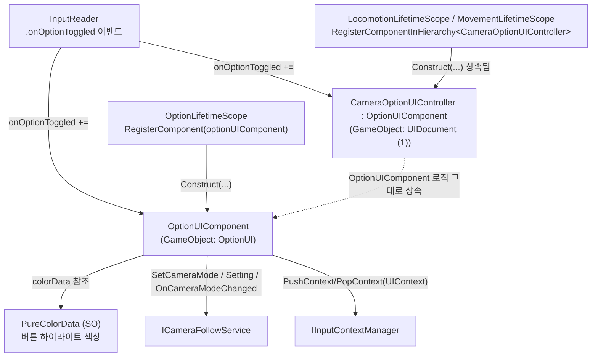
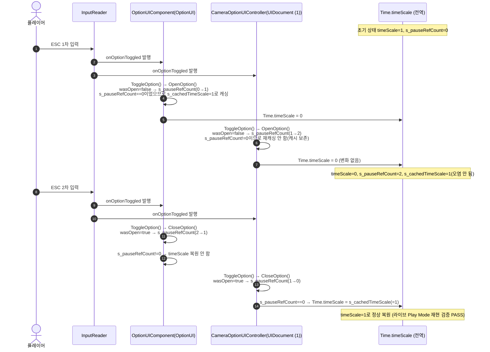

# 8. 환경설정 · 일시정지 메뉴 시스템 (OptionSystem)

> 작성일: 2026-09-15
> 대상 코드: `Assets/02.System/04.OptionSystem/`

---

## 1. 개요

ESC 키(또는 `InputReader.onOptionToggled`)로 옵션 패널을 열고 닫으면서 `Time.timeScale`을 0으로 일시정지시키고, 카메라 모드 전환 UI를 제공하는 시스템이다. `OptionUIComponent`가 핵심 로직을 담당하며, `CameraOptionUIController`는 `OptionUIComponent`를 상속만 하는 빈 파생 클래스로 별도 GameObject(카메라 관련 UIDocument)에 부착되어 있다.

**중요 — 씬에 인스턴스가 2개 존재한다**: `OptionLifetimeScope`가 `OptionUIComponent` 1개를, `LocomotionLifetimeScope`/`MovementLifetimeScope`가 `CameraOptionUIController` 1개를 각각 **독립적으로** DI 등록한다.
- `Assets/02.System/04.OptionSystem/OptionLifetimeScope.cs:21-22` — `if (optionUIComponent != null) builder.RegisterComponent(optionUIComponent); else builder.RegisterComponentInHierarchy<OptionUIComponent>();`
- `Assets/02.System/00.Movement/LocomotionLifetimeScope.cs:68` — `else builder.RegisterComponentInHierarchy<CameraOptionUIController>();`
- `Assets/02.System/00.Movement/MovementLifetimeScope.cs:74` — `else builder.RegisterComponentInHierarchy<CameraOptionUIController>();`

두 인스턴스 모두 `[Inject] Construct(...)`를 통해 동일한 `InputReader`를 주입받아 `onOptionToggled` 이벤트를 각자 구독하므로, ESC 1회 입력 시 **두 인스턴스의 `ToggleOption()`이 동시에 호출**된다.

---

## 2. 구조 다이어그램



**mmdc 검증**: PASS (아래 4절 참고)

---

## 3. 데이터 흐름 — ESC 토글 시 `Time.timeScale` 참조 카운트 시퀀스

기존에는 인스턴스별 `m_cachedTimeScale` 필드에 각자 캐싱/복원했으나, 두 인스턴스가 동시에 반응하면서 오염된 캐시(0)로 서로 덮어써 **일시정지가 영구히 풀리지 않는 버그**가 있었다. 현재는 `static int s_pauseRefCount`, `static float s_cachedTimeScale`(전역 참조 카운트)로 수정되어, 인스턴스가 몇 개든 `Time.timeScale`을 정확히 1번만 캐싱/복원한다.
근거: `Assets/02.System/04.OptionSystem/02.Visualizer/UI/OptionUIComponent.cs:66-67`(필드 선언), `:407-434`(`OpenOption()`), `:436-457`(`CloseOption()`).



**mmdc 검증**: PASS (아래 4절 참고)

`PureColorData`(SO)는 읽기 전용 참조로만 쓰인다: `OptionUIComponent.SetButtonActive()`(`:367-378`)와 `SetTabActive()`(`:380-393`)에서 `colorData.ActiveModeColor` 등 6개 프로퍼티를 조회해 버튼 배경/텍스트 색을 갱신할 뿐, 런타임에 SO 필드를 수정하는 코드는 없다(불변 카탈로그 데이터로만 소비).

---

## 4. mmdc 검증 로그

```
$ npx -y @mermaid-js/mermaid-cli -i option_diagram1.mmd -o option_diagram1.svg
Generating single mermaid chart

$ npx -y @mermaid-js/mermaid-cli -i option_diagram2.mmd -o option_diagram2.svg
Generating single mermaid chart
```
두 블록 모두 에러 없이 SVG 생성 완료(성공).

---

## 5. 다른 시스템과의 상호작용

### 5-1. 이동 · 카메라 시스템 (`ICameraFollowService`)
- `OptionUIComponent.SetCameraMode(CameraMode mode)` (`:329-332`) → `m_cameraFollowService?.SetCameraMode(mode);` 호출. 시그니처: `void SetCameraMode(CameraMode mode)` (`Assets/02.System/00.Movement/01.Logic/01.CameraMovement/Interface/ICameraFollowService.cs`).
- `FilterAllowedModeButtons()`(`:287-297`)에서 `m_cameraFollowService.Setting`(`PureDataCameraSetting`)을 읽어 허용된 카메라 모드 버튼만 노출.
- `SubscribeEvents()`(`:132-136`)에서 `m_cameraFollowService.OnCameraModeChanged += UpdateCameraModeHighlights;` 구독 (`event Action<CameraMode> OnCameraModeChanged`).

### 5-2. `IInputContextManager` 를 경유한 간접 영향
`OptionUIComponent.OpenOption()`/`CloseOption()`이 `manager.PushContext(manager.UIContext)` / `manager.PopContext(manager.UIContext)`를 호출(`:432-433`, `:455-456`)하면, 다른 시스템들이 각자 `CurrentContext.ContextType == InputContextType.UI` 여부를 확인해 입력을 차단한다:
- `Assets/02.System/00.Movement/01.Logic/01.CameraMovement/CameraFollowService.cs:147,153` — `LateTick()`에서 `currentContext.ContextType == InputContextType.UI`이면 마우스 시점 회전·줌 조작 완전 차단.
- `Assets/02.System/01.UnitSystem/01.Logic/UnitQuickSlotLogicSystem.cs:120` — `currentContext.ContextType != InputContextType.Tactical`이면(옵션 UI가 열려 Tactical이 아니게 된 경우 포함) 휠 퀵슬롯 순환 무시.
- `Assets/02.System/06.TacticalCommand/01.Logic/TacticalCommandLogicSystem.cs:203` — 동일하게 Tactical 컨텍스트가 아니면 전술 타깃팅 처리 중단.
- `Assets/02.System/01.UnitSystem/02.Visualizer/MagicLockOnComponent.cs:123` — 동일 패턴으로 마법 락온 조작 차단.

즉 옵션 시스템은 위 시스템들을 직접 호출하지 않고, `IInputContextManager`라는 공유 인터페이스를 통해 "UI가 열려있다"는 상태만 발행하며, 각 시스템이 스스로 그 상태를 조회해 자기 입력을 차단하는 **역방향(pull) 구조**다.

---

## 6. 알려진 이슈 (미해결)

`OptionUIComponent.OnDisable()`(`:120-123`)과 `OnDestroy()`(`:125-128`)는 `UnsubscribeEvents()`만 호출하고 `CloseOption()`은 호출하지 않는다. 따라서 옵션 패널이 **열린 상태(`m_isOpen == true`)** 에서 해당 GameObject가 비활성화되거나 파괴되면(예: 패널이 열린 채 씬 전환) 그 인스턴스 몫의 `s_pauseRefCount`가 영구히 감소하지 않는다. 이후 남은 인스턴스가 전부 정상적으로 닫혀도 참조 카운트가 0에 도달하지 못해 `Time.timeScale`이 복원되지 않는, 원래 버그의 변형이 재발할 수 있는 잠재적 회귀 경로다. 실제 재현은 아직 하지 않았으며 후속 수정 과제로 남아있다.
