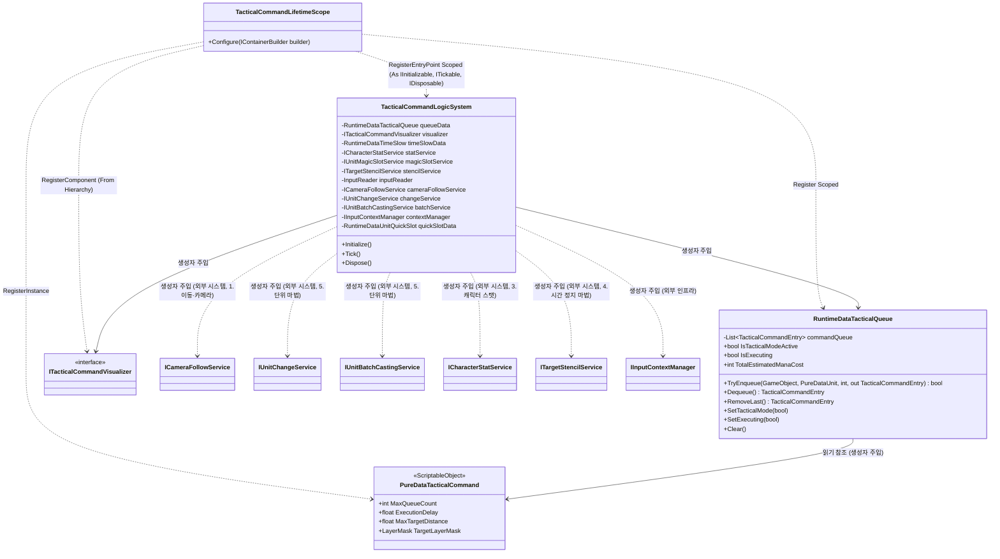
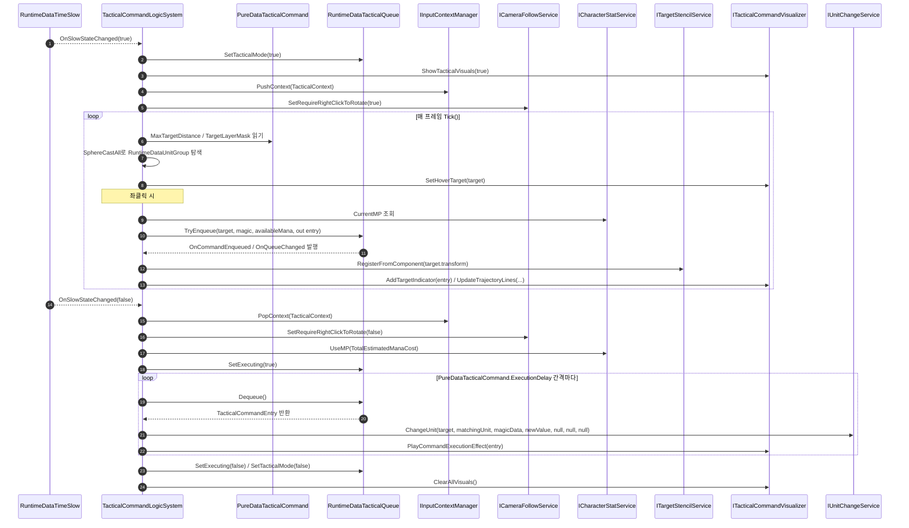

# 6. 전술 커맨드(예약 시전) 시스템

> 작성일: 2026-09-15
> 시간 정지(불릿타임) 중 여러 타깃에 마법을 예약(큐잉)한 뒤, 시간 정지 해제 시 턴제처럼 순차 일괄 발동하는 시스템.

---

## 1. 개요 — VContainer 주입 관계



**근거**: `Assets/02.System/06.TacticalCommand/01.Logic/TacticalCommandLogicSystem.cs:43-70` (생성자 전체 파라미터), `Assets/02.System/06.TacticalCommand/TacticalCommandLifetimeScope.cs:27-64` (Configure)

`TacticalCommandLifetimeScope`의 부모 스코프는 `Assets/02.System/06.TacticalCommand/TacticalCommandLifetimeScope.cs:23`의 `parentReference = ParentReference.Create<UnitSystem.UnitSystemLifetimeScope>();`로, `UnitSystemLifetimeScope → LocomotionLifetimeScope → CharacterLifetimeScope` 체인을 통해 `ICameraFollowService`, `IInputContextManager`, `IUnitChangeService` 등이 실제로 흘러들어온다.

---

## 2. 데이터 흐름 (PureData/RuntimeData 생성·수정·참조)



**근거**: `RuntimeDataTacticalQueue.TryEnqueue/Dequeue/SetTacticalMode/SetExecuting` — `Assets/02.System/06.TacticalCommand/00.Data/RuntimeDataTacticalQueue.cs:62-158`. 시전 흐름 — `Assets/02.System/06.TacticalCommand/01.Logic/TacticalCommandLogicSystem.cs:117-147`(시간정지 진입/해제), `291-328`(TryEnqueueCurrentMagic), `341-417`(StartQueueExecution/ProcessQueueExecution/ExecuteSingleCommand).

`PureDataTacticalCommand`(ScriptableObject, `00.Data/PureDataTacticalCommand.cs:10`)는 불변 설정값(`maxQueueCount`, `executionDelay`, `maxTargetDistance`, `targetLayerMask`, 인디케이터/궤적선 색상)만 보관하며, `RuntimeDataTacticalQueue` 생성자(`00.Data/RuntimeDataTacticalQueue.cs:57-60`)에서 읽기 참조로 주입되어 `MaxQueueCount`(45행), `ProcessTacticalTargeting`의 탐색 거리/레이어마스크(214-215행), `ProcessQueueExecution`의 발동 간격(357행)에 사용된다. 런타임 중 수정되지 않는다.

---

## 3. 다른 시스템과의 상호작용 (Public API 인용)

| 대상 시스템 | 호출 API (전문) | 근거 (인터페이스 정의) | 호출부 |
|---|---|---|---|
| 1. 이동·카메라 | `void SetRequireRightClickToRotate(bool require)` | `Assets/02.System/00.Movement/01.Logic/01.CameraMovement/Interface/ICameraFollowService.cs:22` | `TacticalCommandLogicSystem.cs:97,124,130,171,176,427` — 전술 모드 진입/해제 시 카메라 우클릭 회전 강제 |
| 3. 캐릭터 스탯·상태 | `int CurrentMP { get; }` / `bool UseMP(int amount)` | `Assets/02.System/02.CharacterSystem/01.Logic/ICharacterStatService.cs:13,17` | `TacticalCommandLogicSystem.cs:311`(가용 마나 조회), `348`(해제 시 총 마나 일괄 차감) |
| 4. 시간 정지 마법 | `void RegisterFromComponent(Component component)` | `Assets/02.System/05.TimeSlowFilter/01.Logic/ITargetStencilService.cs:20` | `TacticalCommandLogicSystem.cs:318` — 예약된 타깃을 흑백 필터 제외(컬러 보존) 대상으로 등록 |
| 4. 시간 정지 마법 (역방향) | `event Action<bool> OnSlowStateChanged` (RuntimeDataTimeSlow) | `Assets/02.System/02.CharacterSystem/00.Data/RuntimeDataTimeSlow.cs` | `TacticalCommandLogicSystem.cs:81`(구독), `117`(HandleTimeSlowChanged) — 시간 정지 상태 변화를 수신해 전술 모드 On/Off 트리거 |
| 5. 단위 마법 조작 | `bool ChangeUnit(GameObject targetObject, RuntimeDataUnit targetRuntimeData, PureDataUnit newUnitData, float newValue, RuntimeStatData casterStatData = null, UnitMagicPipeLine pipeLine = null, GameObject casterGameObject = null)` | `Assets/02.System/01.UnitSystem/01.Logic/IUnitChangeService.cs:7` | `TacticalCommandLogicSystem.cs:401` — 큐 순차 실행 시 실제 단위 변환 발동 (마나는 이미 일괄 차감했으므로 `casterStatData`는 `null` 전달) |
| 5. 단위 마법 조작 | `float CalculateNewValue(RuntimeDataUnit targetUnit, PureDataUnit spellUnit)` | `Assets/02.System/01.UnitSystem/01.Logic/UnitBatchCastingService.cs` (`IUnitBatchCastingService`) | `TacticalCommandLogicSystem.cs:396-398` — 신규 수치 계산 (batchService가 없으면 자체 폴백 계산식 사용) |
| 5. 단위 마법 조작 | `PureDataUnit SelectedUnit { get; }` (RuntimeDataUnitQuickSlot) | `Assets/02.System/01.UnitSystem/00.Data/RuntimeDataUnitQuickSlot.cs` | `TacticalCommandLogicSystem.cs:434-436` — 예약 시 현재 선택된 마법 조회 (1순위) |
| 인프라 (입력 컨텍스트) | `void PushContext(IInputContext context)` / `void PopContext(IInputContext context = null)` | `Assets/02.System/99.Common/Input/IInputContextManager.cs:15-16` | `TacticalCommandLogicSystem.cs:95,109,113` — 전술 모드 진입/해제 시 `TacticalContext` 푸시/팝 |

---

## 4. 검증 로그 (mermaid-cli)

문서 내 mermaid 코드 블록 2개를 스크래치패드에 `.mmd`로 추출 후 `npx -y @mermaid-js/mermaid-cli`로 렌더링 검증함.

```
$ npx -y @mermaid-js/mermaid-cli -i tactical_1_class.mmd -o tactical_1_class.svg
Generating single mermaid chart

$ npx -y @mermaid-js/mermaid-cli -i tactical_2_sequence.mmd -o tactical_2_sequence.svg
Generating single mermaid chart
```

두 블록 모두 에러 없이 SVG 생성 성공 (종료 코드 0).
