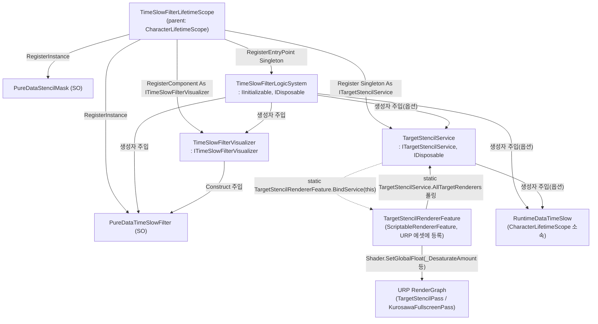
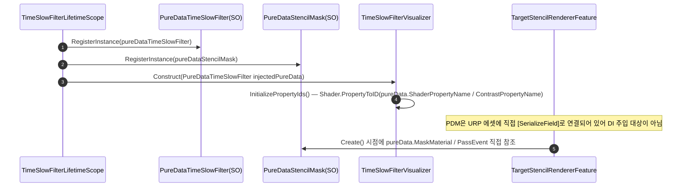
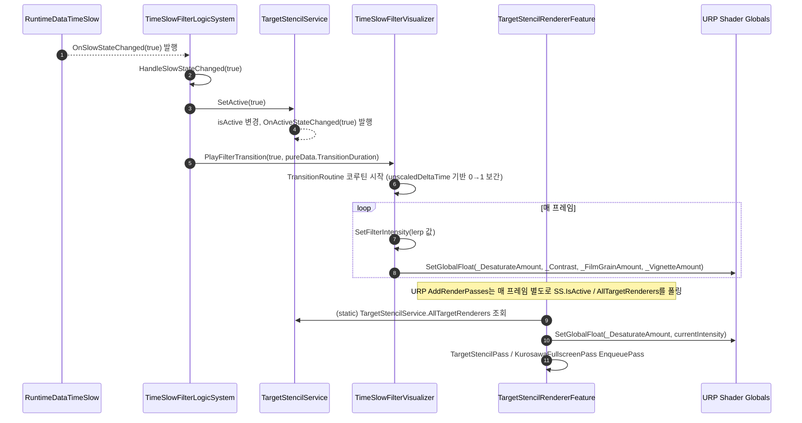

# 4. 시간 정지(불릿타임) 마법 시스템

> 작성일: 2026-09-15
> 범위: 시간 정지 "상태"가 발행된 뒤, 화면 흑백/왜곡 필터와 타깃 제외 스텐실 마스킹을 URP 렌더 파이프라인에 실제로 그려내는 시각 연출 계층.
> **상태 자체(토글, 포커스 게이지 소모/회복)는 이 문서의 범위가 아니다.** `RuntimeDataTimeSlow`(`Assets/02.System/02.CharacterSystem/00.Data/RuntimeDataTimeSlow.cs`)와 `TimeSlowLogicSystem`은 "3. 캐릭터 스탯·상태 시스템" 문서 소관.

---

## 1. 개요 — VContainer 주입 관계 및 URP 연동 구조



**근거**: `Assets/02.System/05.TimeSlowFilter/TimeSlowFilterLifetimeScope.cs:18-53`, `01.Logic/TimeSlowFilterLogicSystem.cs:16-29`, `01.Logic/TargetStencilService.cs:38-47`, `02.Visual/TargetStencilRendererFeature.cs:28-41`.

---

## 2. 데이터 흐름 (sequenceDiagram)

### 2-1. 초기화 — PureData(SO) 참조 확보



### 2-2. 시간 정지 발동 → 화면 연출 반영



**근거**: `TimeSlowFilterLogicSystem.cs:63-68`(HandleSlowStateChanged), `TargetStencilService.cs:73-78`(SetActive), `TimeSlowFilterVisualizer.cs:108-148`(PlayFilterTransition/TransitionRoutine), `TargetStencilRendererFeature.cs:68-112`(AddRenderPasses).

---

## 3. 다른 시스템과의 상호작용

### 3-1. 캐릭터 스탯·상태 시스템 → 이 시스템
- `RuntimeDataTimeSlow.OnSlowStateChanged`(`event Action<bool>`, `Assets/02.System/02.CharacterSystem/00.Data/RuntimeDataTimeSlow.cs:22`)를 `TimeSlowFilterLogicSystem`(우선순위: `ITimeSlowVisualizer.OnSlowStateChanged`가 있으면 그쪽을 먼저 구독하고, 없을 때만 `RuntimeDataTimeSlow`를 구독 — `TimeSlowFilterLogicSystem.cs:33-40`)와 `TargetStencilService`(생성자에서 무조건 구독, `TargetStencilService.cs:49-53`)가 각각 구독한다.

### 3-2. 전술 커맨드 시스템 → 이 시스템
`TacticalCommandLogicSystem`이 `ITargetStencilService`를 생성자 옵션 파라미터로 주입받는다:
```csharp
// Assets/02.System/06.TacticalCommand/01.Logic/TacticalCommandLogicSystem.cs:24, 50
private readonly ITargetStencilService stencilService;
...
ITargetStencilService stencilService = null,
```
호출 시 사용하는 메서드는 인터페이스 정의 기준(`Assets/02.System/05.TimeSlowFilter/01.Logic/ITargetStencilService.cs:16-21`) `RegisterRenderer(Renderer)` / `UnregisterRenderer(Renderer)`이며, 타깃 호버/락온 시 대상 렌더러를 흑백 필터에서 제외시키는 용도로 쓰인다 (타깃을 원래 컬러로 강조 표시).

### 3-3. ⚠️ 발견된 잠재적 결함 — `ITargetStencilService` 중복 등록
grep(`grep -rn "ITargetStencilService" Assets/02.System`)으로 실제 등록부를 확인한 결과, `ITargetStencilService`/`TargetStencilService`가 **서로 다른 두 LifetimeScope에서 각각 독립적으로 Singleton 등록**되고 있다:
1. `Assets/02.System/05.TimeSlowFilter/TimeSlowFilterLifetimeScope.cs:48-50`
   ```csharp
   builder.Register<TargetStencilService>(Lifetime.Singleton)
       .As<ITargetStencilService>()
       .As<System.IDisposable>();
   ```
2. `Assets/02.System/02.CharacterSystem/CharacterLifetimeScope.cs:55-57`
   ```csharp
   builder.Register<TimeSlowFilterSystem.TargetStencilService>(Lifetime.Singleton)
       .As<TimeSlowFilterSystem.ITargetStencilService>()
       .As<System.IDisposable>();
   ```
`TimeSlowFilterLifetimeScope`의 부모가 `CharacterLifetimeScope`이므로(`TimeSlowFilterLifetimeScope.cs:20`), VContainer는 자식 스코프의 자체 등록을 우선 사용해 **서로 다른 두 개의 `TargetStencilService` 인스턴스**가 생성된다. `TargetStencilService` 생성자는 `s_CurrentInstance = this;`를 무조건 실행하므로(`TargetStencilService.cs:46`), 나중에 생성되는 쪽이 렌더러 피처가 실제로 읽는 정적 소스(`AllTargetRenderers`, `TargetStencilRendererFeature.BindService`)를 차지한다. `TacticalCommandLogicSystem`은 `UnitSystemLifetimeScope`(자손, `TimeSlowFilterLifetimeScope`와는 별도 가지) 하위이므로 **`CharacterLifetimeScope`의 인스턴스**를 주입받는 반면, 실제 렌더 결과를 읽는 `TimeSlowFilterLogicSystem`/`TargetStencilRendererFeature`는 스코프 빌드 순서에 따라 어느 인스턴스가 "살아남는지"가 달라질 수 있다. 두 인스턴스가 다르면 전술 커맨드가 등록한 타깃 제외 렌더러가 실제 화면에는 반영되지 않을 수 있는 구조적 위험이 있다. (본 문서는 발견 사항만 기록하며, 수정은 범위 밖.)

---

## 4. 검증 로그 (mermaid-cli)

| 다이어그램 | 명령 | 결과 |
|---|---|---|
| §1 graph TD (VContainer 주입 관계) | `npx -y @mermaid-js/mermaid-cli -i timeslow_1.mmd -o timeslow_1.svg` | 성공 |
| §2-1 sequenceDiagram (초기화) | `npx -y @mermaid-js/mermaid-cli -i timeslow_2.mmd -o timeslow_2.svg` | 성공 |
| §2-2 sequenceDiagram (발동→연출) | `npx -y @mermaid-js/mermaid-cli -i timeslow_3.mmd -o timeslow_3.svg` | 성공 |
