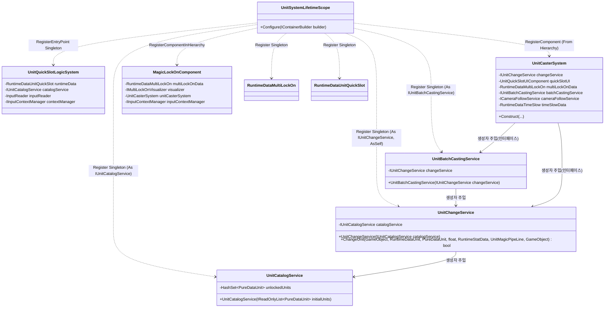
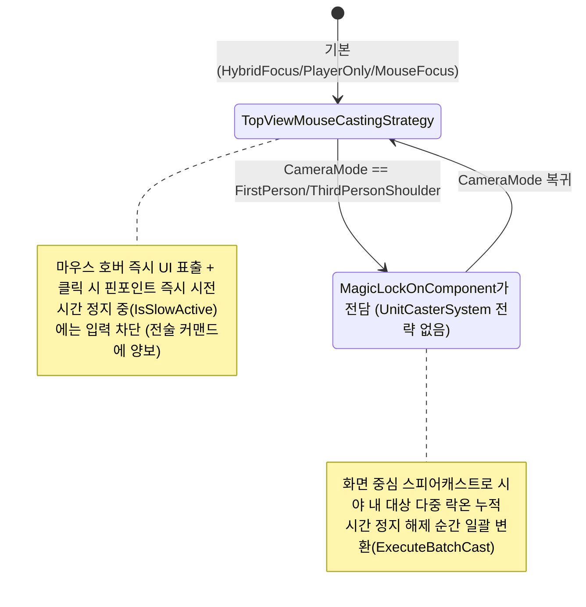
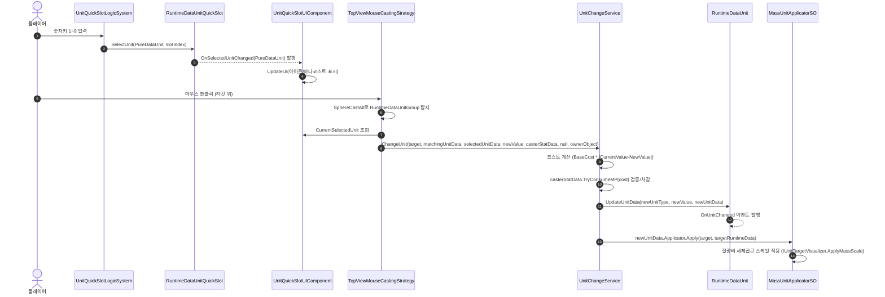

# 5. 단위(Unit) 마법 조작 시스템 (Unit Magic System)

> 작성일: 2026-09-15
> 대상 코드: `Assets/02.System/01.UnitSystem/`

---

## 1. 개요

플레이어가 퀵슬롯(숫자키 1~9 또는 전술 모드 중 마우스 휠)으로 "단위 마법"(질량/부피/방향벡터)을 선택하고, 카메라 시점(탑뷰 vs 1·3인칭)에 따라 전혀 다른 조작 전략(즉시 핀포인트 클릭 vs 시야 내 다중 락온)으로 대상 오브젝트의 물리 단위를 변환시키는 시스템이다. 대상 판정은 `RuntimeDataUnitGroup`(오브젝트에 부착된 지원 단위 목록), 변환 실행은 `UnitChangeService.ChangeUnit(...)`이 전담한다.

## 2. VContainer 주입 관계

**근거**: `Assets/02.System/01.UnitSystem/UnitSystemLifetimeScope.cs:34-71`, `Assets/02.System/01.UnitSystem/01.Logic/UnitCasterSystem.cs:44-64`

## 3. 시점별 조작 전략 (Strategy 패턴)

**근거**: `Assets/02.System/01.UnitSystem/01.Logic/UnitCasterSystem.cs:196-215` (`SwitchByCameraMode`), `Assets/02.System/01.UnitSystem/01.Logic/Strategy/TopViewMouseCastingStrategy.cs:88-93`, `Assets/02.System/01.UnitSystem/02.Visualizer/MagicLockOnComponent.cs:116-123`

> **아키텍처 관찰**: `MultiLockOnLogicSystem.cs`(VContainer ITickable로 별도 등록되어 있지 않음 — grep 결과 어떤 LifetimeScope도 `RegisterEntryPoint<MultiLockOnLogicSystem>`을 호출하지 않아 현재 실제로는 구동되지 않는 사장 코드로 보임)가 `AimLockOnCastingStrategy` 및 `MagicLockOnComponent`와 거의 동일한 "화면 중심 다중 락온 + 시간정지 해제 시 일괄시전" 로직을 중복 구현하고 있다. 리팩토링 시 통합 검토 필요.

## 4. 데이터 흐름 (PureDataUnit → 시전 → RuntimeDataUnit)

**근거**: `Assets/02.System/01.UnitSystem/01.Logic/Strategy/TopViewMouseCastingStrategy.cs:171-179`, `Assets/02.System/01.UnitSystem/01.Logic/UnitChangeService.cs:17-83`, `Assets/02.System/01.UnitSystem/00.Data/RuntimeDataUnit.cs:28-35`, `Assets/02.System/01.UnitSystem/02.Visualizer/MassUnitApplicatorSO.cs:8-33`

## 5. 다른 시스템과의 상호작용

| 상대 시스템 | 호출 주체 | Public API (시그니처) | 전달 데이터 | 근거 |
|---|---|---|---|---|
| 7. 상호작용·피격 | `TopViewMouseCastingStrategy`, `UnitBatchCastingService`, `TacticalCommandLogicSystem` | `IUnitChangeService.ChangeUnit(GameObject targetObject, RuntimeDataUnit targetRuntimeData, PureDataUnit newUnitData, float newValue, CharacterSystem.RuntimeStatData casterStatData = null, PipeLine.UnitMagic.UnitMagicPipeLine pipeLine = null, GameObject casterGameObject = null) : bool` | 타깃/신규 단위/수치/시전자 마나 데이터 | `Assets/02.System/01.UnitSystem/01.Logic/IUnitChangeService.cs:7`, 호출부 `Strategy/TopViewMouseCastingStrategy.cs:178` |
| 3. 캐릭터 스탯·상태 | `UnitChangeService.ChangeUnit(...)` 내부 | `RuntimeStatData.TryConsumeMP(int amount) : bool` (※ `ICharacterStatService.UseMP`가 아니라 `RuntimeStatData`의 전용 메서드를 직접 호출 — 서비스 인터페이스를 우회하지만 캡슐화된 전용 메서드라 안전) | 필요 마나 수치 | `Assets/02.System/01.UnitSystem/01.Logic/UnitChangeService.cs:61-68`, 정의부 `Assets/02.System/02.CharacterSystem/00.Data/RuntimeStatData.cs` |
| 1. 이동·카메라 | `UnitCasterSystem` | `ICameraFollowService.CurrentMode`(get) / `event Action<CameraMode> OnCameraModeChanged` | 현재 카메라 모드 | `Assets/02.System/01.UnitSystem/01.Logic/UnitCasterSystem.cs:124-140`, 정의부 `Assets/02.System/00.Movement/01.Logic/01.CameraMovement/Interface/ICameraFollowService.cs` |
| 4. 시간 정지 마법 | `RuntimeDataUnitGroup`(OnEnable/OnDisable) | `TargetStencilService.RegisterTargetStatic(Component)` / `UnregisterTargetStatic(Component)` (static 메서드, DI 미경유) | 자기 자신(Component) | `Assets/02.System/01.UnitSystem/00.Data/RuntimeDataUnitGroup.cs:44,49` |
| 4. 시간 정지 마법 | `TopViewMouseCastingStrategy`, `AimLockOnCastingStrategy` | `CharacterSystem.RuntimeDataTimeSlow.IsSlowActive`(get) | 시간정지 활성 여부 | `Assets/02.System/01.UnitSystem/01.Logic/Strategy/TopViewMouseCastingStrategy.cs:89` |
| 공용 입력 | `UnitQuickSlotLogicSystem`, `MagicLockOnComponent` | `Common.InputSystem.IInputContextManager.CurrentContext`(get) | 현재 입력 컨텍스트 | `Assets/02.System/01.UnitSystem/01.Logic/UnitQuickSlotLogicSystem.cs:118-123` |

> **참고**: `RuntimeDataUnitGroup`이 `TargetStencilService`를 static 메서드로 직접 호출하는 부분은 오늘 세션에서 다룬 "정적 싱글톤/서비스 로케이터 제거" 원칙의 예외로 남아있는 지점이다(별도 개선 과제).
