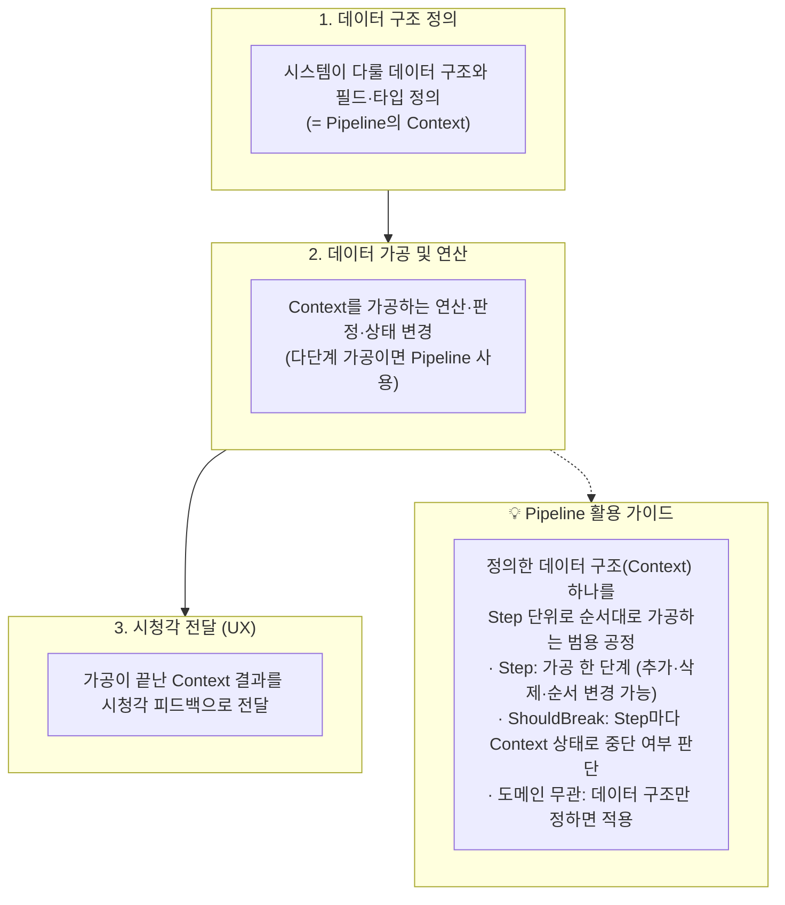

# 코드 작업 기획서 가이드라인 v1.0
> v1.0 변경점: "3-1. 데이터 정의 및 흐름 규칙"(사용 데이터 필드 → 가공 방식 → 시청각 UX 전달, 체크리스트 연결) 신설, "3-1-1. 기획 진행 순서 및 Pipeline 활용"(데이터 → 로직 → 비주얼 순서 도표, 필요 시 범용 Pipeline 사용 기준) 신설, "3-2. 폴더 구조 규칙" 신설(표준 폴더 구조의 원본 정의를 이 문서로 통일, `QA_가이드라인_v1.0.md`는 이 문서를 참조만 함).

---

## 1. 작성 목적
코드 작업 전 작업 유형별 맞춤 요구사항 및 설계 명확화

---

## 2. 코드 작업 2대 분류

### 2-1. 시청각 표시 영역 코드
* 범위: UI / Visual / Effect / Audio 영역
* 핵심 요구사항: **사용자 행동 입력에 따른 실질적 동작 및 결과** 명세
  - 예시 1: 사용자가 옵션 창 메인 볼륨 슬라이더 조절 조작 시 실시간으로 사운드 출력 크기가 조절이 가능하다.
  - 예시 2: 슬라이더 옆 음소거 버튼으로 음소거가 가능하다.

### 2-2. 비시청각 영역 코드
* 범위: Pure Data / Logic / Core System 영역
* 서술 공식: **[구현 수단 / 방법] + [기대 효과 / 최적화 목표]** 한 문장 결합 명세
  - 예시 1: 매 프레임 호출 문자열 연산 구조를 StringBuilder 객체 재사용 구조로 개편하여 메모리 할당 최소화 및 가비지 컬렉션 발생 방지
  - 예시 2: 빈번히 생성/파괴 투사체 객체를 오브젝트 풀링 구조로 구현하여 CPU 연산 부하 감소 및 프레임 안정화

---

## 3. 기획서 필수 포함 항목
1. 작업 개요 및 작업 유형 분류 (시청각 / 비시청각)
2. 유형별 맞춤 핵심 요구사항 (사용자 동작 결과 정의 / 구현 수단 + 최적화 목표 한 문장 서술)
3. **데이터 정의 및 흐름** (아래 3-1 참고) — 이 시스템이 사용/정의하는 데이터 구조, 그 데이터를 어떻게 가공해서 어떤 결과를 도출하는지, 그 결과가 유저에게 어떤 시청각적 형태(UX)로 전달되는지
4. DLV 아키텍처 적용 방안 (Data / Logic / Visual 구조) — **아래 3-2 폴더 구조 규칙에 따라 실제 폴더 경로까지 명시**
5. 예상 검수 방법 및 테스트 가이드 — **체크리스트는 반드시 3번(데이터 정의 및 흐름)을 근거로 작성**(아래 3-1 참고)

### 3-1. 데이터 정의 및 흐름 규칙

기획서는 "무엇을 만들지"뿐 아니라 **어떤 데이터를 다루고, 그 데이터가 어떻게 가공되어, 어떤 결과가 유저에게 전달되는지**까지 명시해야 한다. 개발자 입장에서 "어떤 데이터를 어떻게 가공해서 사용할 것이고, 그 결과가 시청각적으로 유저에게 어떻게 전달되는지(어떤 UX를 제공하는지)"가 기획서 전반과 체크리스트에 드러나야 한다.

- **데이터 구조 정의**: 이 시스템이 새로 정의하거나 사용하는 PureData/RuntimeData의 필드를 필드 단위로 나열한다(필드명, 타입, 의미). 예: "캐릭터 스탯" 시스템이라면 막연히 "스탯 데이터"라고 쓰지 않고 `HP(int, 현재 체력)`, `MaxHP(int, 최대 체력)`, `MP(int, 현재 마나)`처럼 구체적으로 적는다.
- **데이터 가공/흐름 서술**: 위 데이터를 시스템이 **어떻게 가공(연산·판단)해서 어떤 결과값/상태 전이**로 이어지는지 설명한다. (예: "RawDamage에서 Defense를 뺀 값을 FinalDamage로 산출하고, 이 값을 HP.CurrentValue에서 차감한다")
- **시청각 전달(UX) 서술**: 그 결과가 유저에게 **구체적으로 어떤 시청각 형태**(HUD 수치 변화, 이펙트, 사운드, 애니메이션 등)로 전달되는지 설명한다.
- **체크리스트와의 연결(필수)**: 5번(예상 검수 방법) 절의 체크리스트 항목은 반드시 이 데이터→가공→결과 흐름을 근거로, "[어떤 데이터/조작]을 하면 → [어떤 가공을 거쳐] → [어떤 시청각 결과]가 유저에게 나타난다" 형태로 작성한다. 데이터 흐름과 무관하게 막연히 "정상 동작한다"처럼 쓰지 않는다.

#### 3-1-1. 기획 진행 순서 및 Pipeline 활용

시스템 기획은 반드시 **① 데이터 정의 → ② 로직(데이터 가공·연산) → ③ 비주얼(시청각 전달)** 순서로 진행한다. 앞 단계가 확정되지 않은 상태에서 다음 단계를 서술하지 않는다(데이터 구조 없이 로직을, 로직 결과 없이 연출을 먼저 정하지 않는다).



**Pipeline이란** — 특정 시스템에 종속된 기능이 아니라, 1단계에서 정의한 데이터 구조(Context) 하나를 역할이 하나씩인 Step들이 순서대로 가공하는 **범용 공정**이다(`Assets/PipeLine/PipeLineBase`의 `IPipeLineStep<T>` / `PipeLineSo<T>`). 전투·마법·퀘스트·상태이상 등 도메인과 무관하게 적용할 수 있다.

- **Context**: 1단계에서 정의한 데이터 구조. 입력값, 중간 판정값, 결과값, 중단 조건을 함께 담는다.
- **Step**: Context를 받아 가공 한 단계를 수행하고 돌려준다. 추가·삭제·순서 변경은 Step 단위로 한다.
- **ShouldBreak(중단 조건)**: Step이 끝날 때마다 Context 상태를 보고 이후 공정을 계속할지 판단한다.
- **결과 전달**: 공정이 끝난 Context가 3단계(시청각 전달)의 입력이 된다.

**사용 판단 기준 (필요할 때만 사용)** — 2단계 가공이 아래에 해당하면 Pipeline 사용을 검토하고, 단일 계산이나 단순 상태 토글처럼 한 단계로 끝나는 가공에는 사용하지 않는다.
- 가공이 **여러 판정 단계로 나뉘는** 경우 (예: 명중 → 치명 → 방어)
- 중간 단계에서 **실패 시 이후 가공을 중단해야 하는** 경우 (예: 마나 부족 시 변환 차단)
- 상황·대상에 따라 **단계 조합이나 순서가 달라지는** 경우

**Pipeline 사용 시 기획서 명시 항목** — Pipeline을 사용하기로 했다면 2단계(데이터 가공/흐름 서술)에 다음을 적는다.
- Context로 쓰일 데이터 구조 (1단계에서 정의한 필드 중 어떤 것이 입력·판정·결과·중단 플래그인지)
- Step 목록과 실행 순서, 각 Step이 Context의 어떤 필드를 읽고 쓰는지
- 중단 조건(ShouldBreak)과, 중단 시 3단계에서 유저에게 전달되는 시청각 결과

### 3-2. 폴더 구조 규칙 (신규 기능 작업 시 기획서에 실제 경로로 명시)

새 기능을 작업할 때는 아래 표준 구조에 맞춰 **이번 작업이 어떤 폴더에 어떻게 배치되는지**를 기획서에 구체적으로 적어야 한다(QA 서브 에이전트는 이 기획서에 적힌 경로/구조를 기준으로 준수 여부를 검사한다 — 이 문서가 원본, `QA_가이드라인_v1.0.md`는 이 규칙을 참조만 함).

```text
[순번].[기능명]/                    # 기존 최대 번호 + 1 (예: 기존 10번까지 존재 시 11.Inventory)
├── [기능명]LifetimeScope.cs       # 기능 루트 바로 아래 위치 (하위 폴더 진입 금지)
├── 00.Data/                       # PureData, RuntimeData만 위치
├── 01.Logic/                      # MonoBehaviour 없는 순수 C# 로직만 위치
├── 02.Visualizer/                 # 인터페이스, 비주얼 컴포넌트, UI View만 위치
└── 99.Legacy/                     # 기존 구형 코드 격리 보관
```

- **기능 폴더 순차 넘버링** — 폴더명이 `[순번].[기능명]` 형식이며, 기존 기능 번호에 이어지는 다음 번호인가?
- **Scope 파일 위치 준수** — `[순번].[기능명]/` 루트 바로 아래에 `[기능명]LifetimeScope.cs`가 존재하는가? (하위 폴더 배치 금지)
- **00.Data** — `PureData`(ScriptableObject)와 `RuntimeData`(순수 C#)만 위치하는가?
- **01.Logic** — MonoBehaviour를 상속받지 않는 순수 C# 로직 파일만 위치하는가?
- **02.Visualizer** — 인터페이스(`I...`), 비주얼 컴포넌트, UI View 파일만 위치하는가?
- **99.Legacy** — 기존 코드가 있을 경우 해당 폴더로 안전하게 격리 보관되었는가?

---

## 4. 작성 시점
* 코드 작성 전 사용자 명시적 요구 시 작성
